layout: true

<div class="my-footer">
  <span>&emsp;
  Pekka Sagner M.Sc.
  &emsp;&emsp;&emsp;&emsp;&emsp;&emsp;&emsp;&emsp;&emsp;&emsp;&emsp;&emsp;&emsp;
  &emsp;&emsp;&emsp;&emsp;&emsp;&emsp;&emsp;&emsp;&emsp;&emsp;&emsp;&emsp;&emsp;
  &emsp;&emsp;&emsp;&emsp;&emsp;
  Datenanalyse und -visualisierung</span> 
</div>


```{r setup, include=FALSE}
# dateWritten <- format(as.Date('2020-05-04'), format="%B %d %Y")
# workshop_day <- format(as.Date("2021-07-09"), format="%d\\. %B  %Y")
# semester <- "Wintersemester 2021/22"
pacman::p_load(tidyverse, fontawesome, tidyverse, knitr, xaringanExtra)

options(
    htmltools.dir.version = FALSE,
    knitr.table.format = "html",
    knitr.kable.NA = ""
)
knitr::opts_chunk$set(
    warning = FALSE,
    message = FALSE,
    fig.path = "figs/",
    fig.width = 7.252,
    fig.height = 4,
    comment = "#>",
    fig.retina = 3 # Better figure resolution
)
# Enables the ability to show all slides in a tile overview by pressing "o"
xaringanExtra::use_tile_view()
xaringanExtra::use_panelset()
xaringanExtra::use_clipboard()
xaringanExtra::use_share_again()
xaringanExtra::style_share_again(share_buttons = "all")
xaringanExtra::use_extra_styles(
  hover_code_line = TRUE,
  mute_unhighlighted_code = FALSE
)

knitr::opts_chunk$set(warning = F, message = F) # Whether to display errors
```
 
---

#Datenanalyse und -visualisierung

## mit der Programmiersprache R

.split3070_left[

### Pekka Sagner M.Sc.

[`r fa(name = "envelope", fill = "black")` sagner@iwkoeln.de](mailto:sagner@iwkoeln.de)<br>
[`r fa(name = "user", fill = "black")` iwkoeln.de/.../pekka-sagner](https://www.iwkoeln.de/institut/personen/pekka-sagner.html)<br>
[`r fa(name = "github", fill = "black")` @pekkasagner](http://github.com/pekkasagner)

Wintersemester 2021/22

.font60[Letzte Aktualisierung:  `r format(Sys.time(), '%d. %B %Y')`
]

.font60[Link zu den Folien: [pekkasagner.github.io/Einfuehrung_in_R](https://pekkasagner.github.io/Einfuehrung_in_R)
  ]
]

.split3070_right[

]


---
class: clear, inverse, middle, center

#Was wir im Kurs lernen

---

#Was wir im Kurs lernen

+ Data Science ist ein riesiges Feld. Es ist unmöglich Experte auf jedem Gebiet zu sein.
+ Ziel des Kurses ist es, ein solides Fundament zu schaffen, auf dem viele Aufgaben im Bereich Data Science aufbauen.
+ Die Arbeit mit Daten ist im Grunde recht simpel aufgebaut:


.center[

]

.right[
.font50[
Quelle: [R4DS](https://r4ds.had.co.nz/introduction.html), eigene Darstellung
]
]


---
class: clear, middle, center


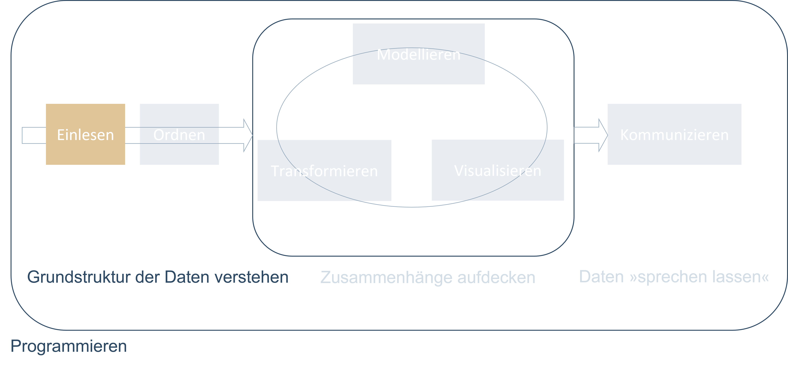

---
#Daten einlesen

+ Typischerweise entweder aus einer Datei, Datenbank oder einer Programmierschnittstelle (API).

+ Der erste Schritt ist der wichtigste: Wenn wir unsere Daten nicht in R einlesen können, können wir diese auch nicht analysieren, nicht visualisieren, nicht ...


+ Leseempfehlung: 
  + [The Tidyverse Cookbook, Kapitel 2 (Grolemund, 2020)](https://rstudio-education.github.io/tidyverse-cookbook/import.html)
  + [R4DS, Kapitel 11 (Wickham, 2017)](https://r4ds.had.co.nz/data-import.html)

+ Weitere Ressourcen: 
  + [Vortrag von Hadley Wickham (Video)](https://www.rstudio.com/resources/webinars/getting-data-into-r/) zum Einlesen verschiedener Datentypen.
  
---
class: clear, middle, center


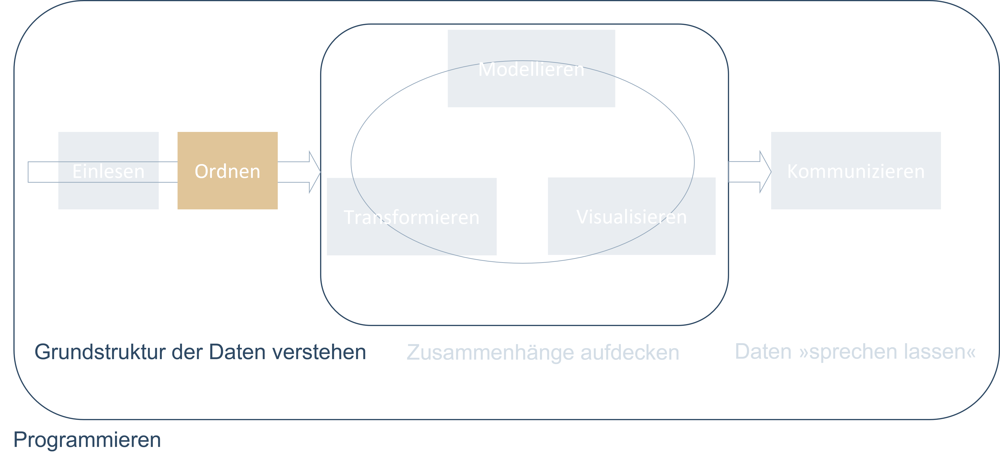


---
#Daten ordnen

+ **Ordentliche Daten** sind Daten, die in einem konsistenten Format vorliegen und zur Natur der Daten passen.

+ Das Konzept der **Tidy Data** ist für die Arbeit mit Daten essenziell.


+ Struktur &raquo;ordentlicher&laquo; Daten:

 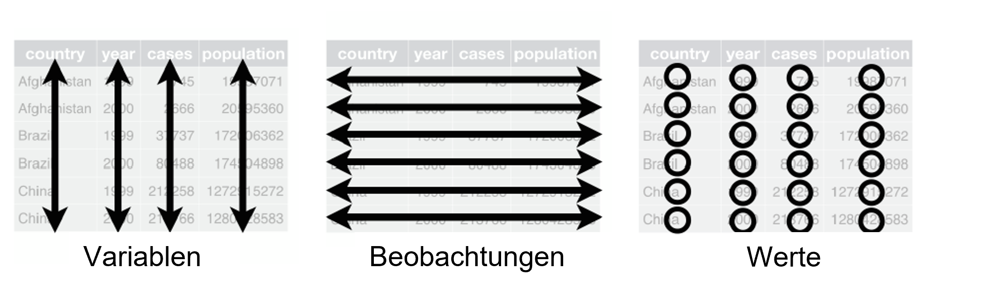


+ Leseempfehlung: [Tidy Data (Wickham, 2014)](https://www.jstatsoft.org/article/view/v059i10)

+ Die beiden ersten Schritte sind eng miteinander verknüpft.
  + Durch das richtige Einlesen der Daten kann man sich häufig viel Zeit beim Daten ordnen sparen.
  
---
#&raquo;Garbage in, garbage out&laquo;

+ Der Zeitaufwand, den die ersten Schritte bei einem Datenprojekt in Anspruch nehmen, sollte nicht unterschätzt werden:


.panelset[
  .panel[.panel-name[Plot]

  ]

  .panel[.panel-name[R-Code]
```{r arbeitszeitplot, fig.show='hide'}
data <- tibble(Arbeitsschritt = c("Daten einlesen", "Daten ordnen", "Daten visualisieren", 
                                "Modell auswählen", "Modell verfeinern", "Modell anwenden"),
               Zeitaufwand = c(0.19, 0.26, 0.21, 0.11, 0.12, 0.11))

data %>% 
  ggplot(aes(x = Arbeitsschritt, y = Zeitaufwand, fill = Arbeitsschritt)) +
  geom_col() +
  scale_y_continuous(labels = scales::percent_format()) +
  theme_minimal() +
  IWcoloRs::scale_fill_IW() +
  theme(legend.position = "none") +
  labs(title = "Anteil der Arbeitszeit, den Data Scientists für den\njeweiligen Arbeitsschritt aufwenden",
       subtitle = "in Prozent")
``` 
  ]
]

.font50[
Quelle: [Anaconda.com](https://www.anaconda.com/state-of-data-science-2020?utm_medium=press&utm_source=anaconda&utm_campaign=sods-2020&utm_content=report), eigene Darstellung
]

---
class: clear, middle, center


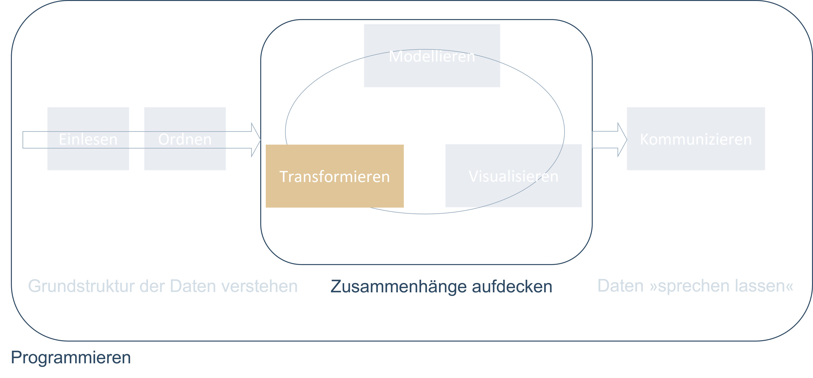

---
#Daten transformieren

+ In den seltensten Fällen kommen wir ohne die Transformation von Daten aus. (Ein Beispiel ist die vorherige Abbildung.)

+ In der Regel ist es unsere Aufgabe, aus Daten schlau zu werden.

+ Daten können auf verschiedenste Weise transformiert werden:
  + **Fokussieren auf Beobachtungen von Interesse**: zum Beispiel Menschen, die in einem bestimmten Land wohnen oder Daten aus einem speziellen Jahr.
  
  + **Erstellen neuer Variablen aus bestehenden**: zum Beispiel BIP pro Kopf aus dem gesamten Bruttoinlandsprodukt eines Landes geteilt durch die Anzahl an Einwohnern.
  
  + **Berechnen zusammenfassender Statistiken**: zum Beispiel Durchschnitte, Medianwerte oder Anteile.
  
+ Das ordnen und das Transformieren von Daten nennt man auch **Data Wrangling**.

+ Dies ist eine Anspielung darauf, dass es ein Kampf sein kann, bis die Daten im &raquo;richtigen&laquo; Format sind.


---
class: clear, middle, center


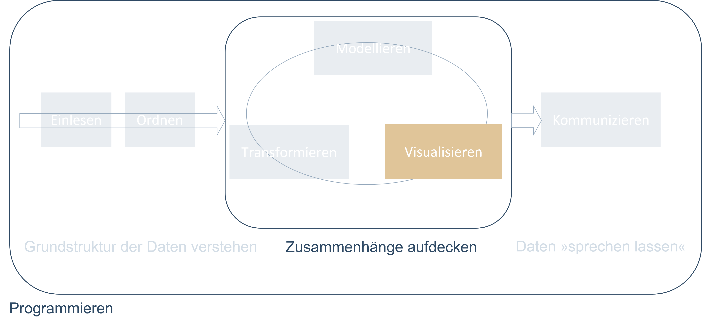


---
#.font80[&raquo;Ein Bild sagt mehr als tausend Worte.&laquo; - Daten visualisieren I/II
]

+ Sind die Daten im richtigen Format, gibt es zwei wesentliche Vorgehensweisen, um daraus neues Wissen zu schaffen: **Visualisierung** und **Modellierung**. Die beiden Vorgehensweisen sind komplementär.


+ Eine gute Visualisierung zeigt möglicherweise unerwartete Dinge.

+ Visualisierungen sind auf dem Weg zum besseren Verständnis von Daten ein unerlässliches Instrument. 

+ Oft zeigen uns Abbildungen, dass &raquo;irgendetwas in den Daten nicht stimmt.&laquo;

+ Sie sind deshalb ein mächtiges Instrument und sollten Teil der explorativen Datenanalyse sein.

+ R ist wegen seiner guten Visualisierungsmöglichkeiten, die auf einer **Grammar of Graphics** basieren, sehr beliebt.

+ Leseempfehlung: 
  + [R4DS, Kapitel 3 (Wickham, 2017)](https://r4ds.had.co.nz/data-visualisation.html)
  + [A Layered Grammar of Graphics (Wickham, 2010)](http://vita.had.co.nz/papers/layered-grammar.pdf)
  + [ggplot2: Elegant Graphics for Data Analysis (Wickham, 2021)](https://ggplot2-book.org/index.html)
  + [R Graphics Coobook (Chang, 2021)](https://r-graphics.org/)

---
#Daten visualisieren II/II
.panelset[
  .panel[.panel-name[Gute Visualisierung]
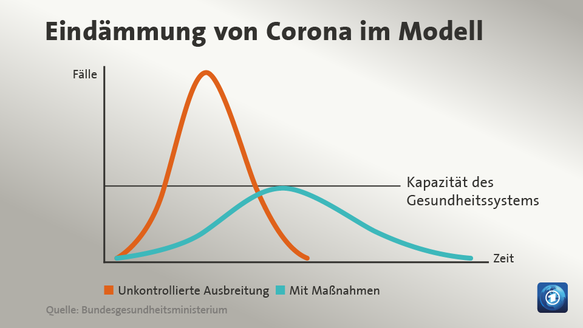
  ]
  .panel[.panel-name[Schlechte Visualisierung]
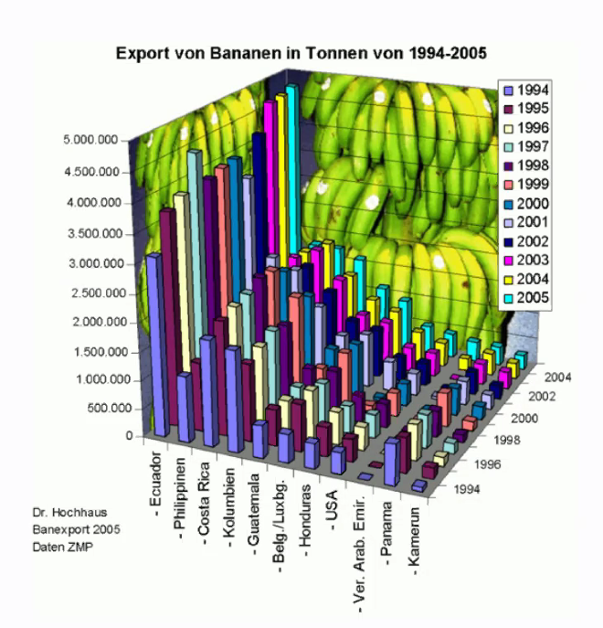
  ]
  .panel[.panel-name[Alternative zur schlechten Visualisierung]
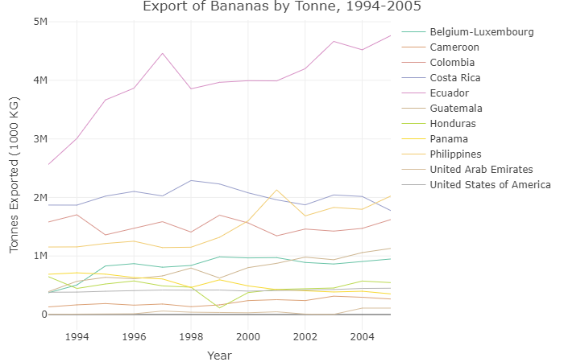
  .font50[
  Quelle: [Clarkdatalabs](https://clarkdatalabs.github.io/banana-project/R_Banana_Project/docs/ )
  ]
  ] 
  
]

---
class: clear, middle, center


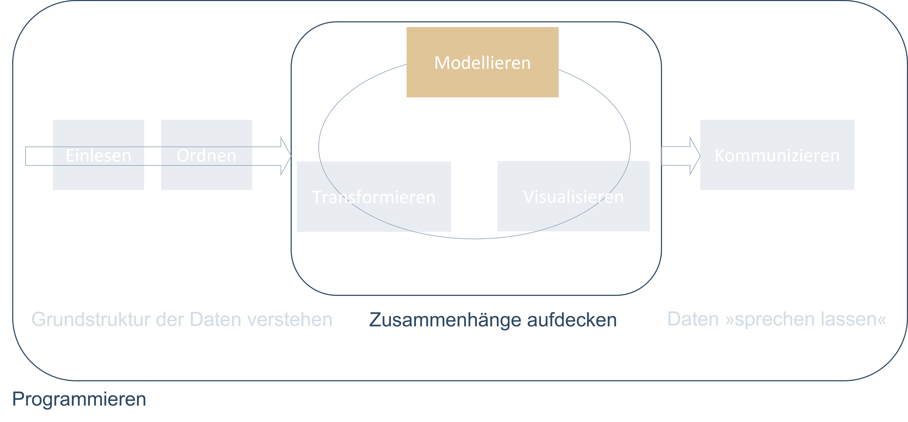

---
#Daten modellieren

+ Modelle sind komplementär zu Visualisierungen.

+ Modelle abstrahieren.

  + Ein Modell verwendet häufig die Formulierung &raquo;Wir nehmen an.&laquo;
  + Wir vereinfachen in einem Modell die Realität, um uns auf bestimmte Fragen zu konzentrieren.
  
+ Modelle sind ein wichtiger Teil der (empirischen) Wirtschaftsforschung.

+ Im Kurs schneiden wir die ökonometrische Modellierung mit R nur an.

+ Leseempfehlung:
  + [R4DS, Kapitel 22-25 (Wickham, 2017)](https://r4ds.had.co.nz/model-intro.html)
  
+  Weiterführende Literatur:
  + [Tidy Modeling with R (Kuhn & Silge, 2021)](https://www.tmwr.org/)

---
class: clear, middle, center


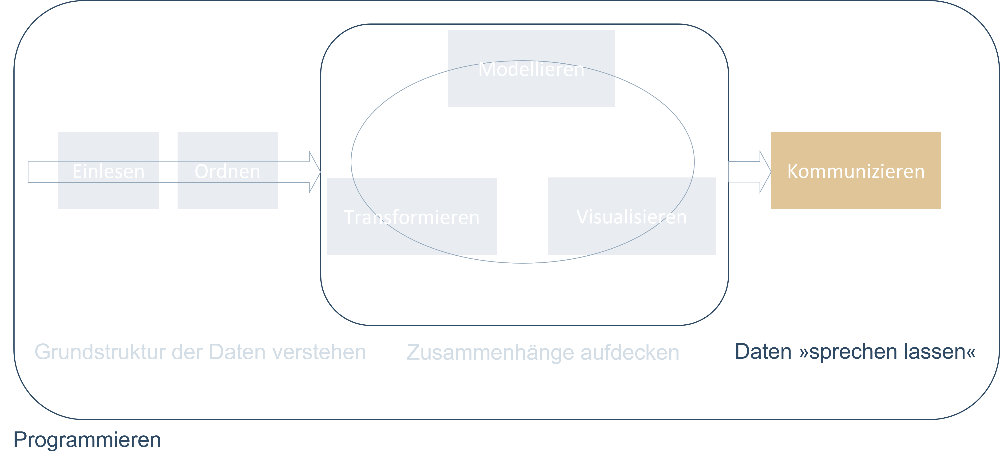


---
#Daten und Ergebnisse kommunizieren I/II

+ Die Kommunikation von Ergebnissen einer Datenanalyse ist mindestens so wichtig wie alle Schritte zuvor.

+ Die Datenanalyse mag bis zum Punkt der Kommunikation perfekt gewesen sein, am Ende gilt es jedoch, anderen die Ergebnisse zu vermitteln.

+ Wie man die Daten kommuniziert lässt sich nicht pauschal beantworten.

+ Es gibt jedoch fast immer Alternativen, um dieselben Ergebnisse zu kommunizieren.

+ Leseempfehlung: [R4DS, Kapitel 26-30](https://r4ds.had.co.nz/communicate-intro.html)

---
#Daten und Ergebnisse kommunizieren II/II

```{r include=F}
library(Ecdat)
data(Housing)

model1 <- lm(log(price) ~ ., data = Housing)
```
 
.panelset[
  .panel[.panel-name[Klassische Kommunikation]
  .font50[
```{r results='asis', echo=FALSE}
model1 %>% 
  sjPlot::tab_model()
```
]
  ]
  .panel[.panel-name[Alternative Kommunikation]
```{r results='asis', echo=FALSE, fig.width=10, fig.height=6}
model1 %>% 
  sjPlot::plot_model() + 
  ylim(0, 0.3)
```
  ]
  .panel[.panel-name[Code für beide Alternativen]
```{r eval=FALSE}
#Daten laden
library(tidyverse)
library(Ecdat)
data(Housing)
#Modell bestimmen
model1 <- lm(log(price) ~ ., data = Housing)
#Klassiche Kommunikation als Regressionstabelle
model1 %>% 
  sjPlot::tab_model()
#Alternative Kommunikation als Koeffizientenplot
model1 %>% 
  sjPlot::plot_model()
```
  ]
  
]

---
class: clear, middle, center


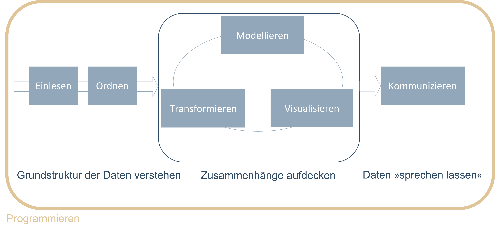


---
#Programmieren


+ Grundsätzlich muss die Datenanalyse nicht zwingend durch das Programmieren erfolgen. Man hat die Wahl zwischen dem Erlernen einer **Grafischen Benutzeroberfläche** (GUI - Graphical User Interface) oder einer **Programmiersprache**.

+ **Programmieren** bietet jedoch Vorteile gegenüber einer GUI:

  + **Reproduzierbarkeit**: Die Möglichkeit, eine Analyse nachzuvollziehen und zu reproduzieren ist die Grundlage guter wissenschaftlicher Praxis.
  + **Automatisierung**: Befähigt uns Datenanalyseschritte schnell zu wiederholen, falls sich etwas an der Datengrundlage ändert.
  + **Kommunikation**: Programme sind Code und Code ist Text. Text lässt sich einfach kommunizieren und teilen. Auch der Lernprozess wird dadurch vereinfacht.
  
+ Leseempfehlung:
  + [Hands-On Programming with R (Grolemund, 2014)](https://rstudio-education.github.io/hopr/)
  + [R4DS, Kapitel 17-21 (Wickham, 2017)](https://r4ds.had.co.nz/program-intro.html)

---

class: clear, inverse, middle, center


---

#Was ist ? I/II

+ R ist eine **Programmiersprache** und **kostenfreie** Software.
+ Es ist eine Umgebung, in der statistische Methoden implementiert sind.
+ R bietet standardmäßige Funktionalitäten `r fa(name = "arrow-right", fill = "black")` [&raquo;Base-R&laquo;](https://stat.ethz.ch/R-manual/R-devel/library/base/html/base-package.html)
+ Es ist mit **Packages** erweiterbar.
  + Ein Package ist eine **Sammlung von Funktionen**.
  + Die Funktionen erweitern die Basisfunktionalität.
  + Das Paket [readxl](https://readxl.tidyverse.org/reference/excel_format.html) zum Beispiel bietet eine Sammlung von Funktionen, um Excel-Dateien einzulesen, die nicht standardmäßig in R enthalten sind.

.split3070_right[
.font50[
   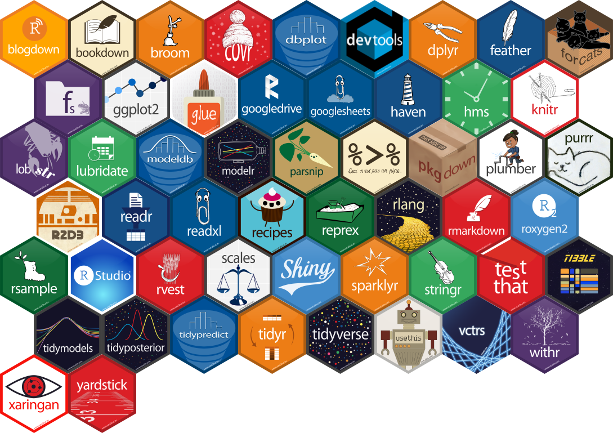
Quelle: [Mitchell O'Hara-Wild](https://www.mitchelloharawild.com/blog/hexwall/)
]
]

---

#Was ist ? II/II

+ Im Kern ist R ein schicker *Taschenrechner*.

--
```{r}
1+2 
```

--
+ Alle Rechenoperationen sind möglich:

```{r}
(1+2) / (3-4) * (5^6)
```

--
+ Das kann aber eben auch jeder Taschenrechner. In der Praxis arbeiten wir häufig mit Datensätzen als Input, verändern diese und generieren irgendeine Form von Output.


---

class: clear, inverse, middle, center


---

#Was ist ?

+ RStudio ist das **Cockpit**, R ist der **Motor**.
+ Wir lernen und arbeiten mit R und nutzen dafür RStudio.
+ RStudio bietet eine benutzerfreundliche **Bedienoberfläche**, um in R zu &raquo;coden&laquo;.
+ RStudio ist grundsätzlich nicht zwingend erforderlich, macht das Arbeiten mit R aber wesentlich einfacher.
+ Die Benutzeroberfläche lässt sich recht frei, je nach persönlicher Präferenz, anpassen.

.center[
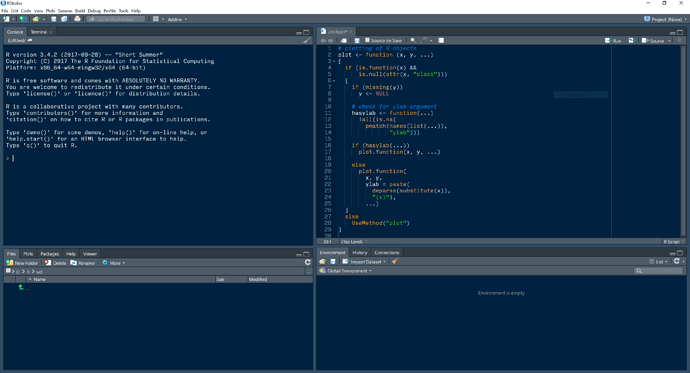
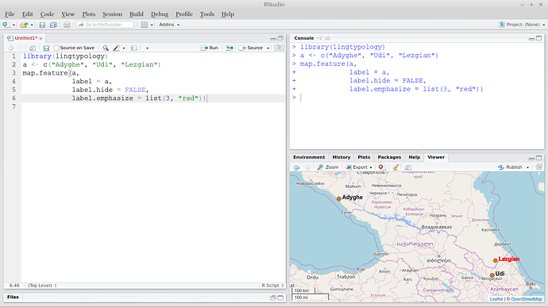
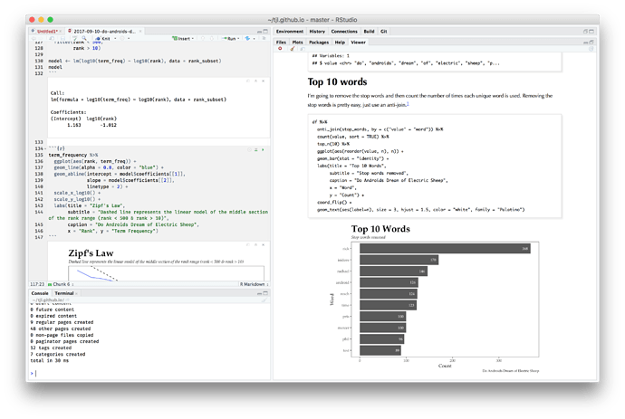
]
.font50[Quelle: [RStudio Community](https://community.rstudio.com/t/whats-your-rstudio-pane-layout/1528/6)
]

---
#Allgemeine Ressourcen

Die Zahl an Ressourcen, um R zu lernen ist groß. Viele Ressourcen sind kostenfrei.

Für den Einstieg:
+ [R for Data Science (R4DS), (Wickham, 2017)](https://r4ds.had.co.nz/)
  + Idealer Einstieg zum Selbstlernen, viele Beispiele.
  + Weite Teile des Kurses basieren auf diesem Buch.
  + Nutzt das [Tidyverse](https://www.tidyverse.org/).

Für den Einstieg und darüber hinaus:
+ [Modern Data Science with R (Baumer et al., 2021)](https://mdsr-book.github.io/mdsr2e/)
  + Führt ebenfalls die wichtigsten Konzepte ein.
  + Darüber hinaus Einführung in statistische Grundlagen und Modellierung.
  + Guter Einblick in verschiedene Datentypen, z.B. Textdaten, Geodaten.
+ [Modern Statistics with R (Thulin, 2021)](http://www.modernstatisticswithr.com/)
  + Gute Einführung in die Grundlagen.
  + Fokus auf der Illustration und Anwendung statistischer Methoden mit R.

---
#Thematische Ressourcen

+ Die Themen und Probleme mit denen sich Data Science beschäftigt sind schier endlos.

+ Für die meisten gibt es Lösungen in R.

+ **&raquo;Das einzige Lesezeichen, das man braucht&laquo;**: [Big Book of R (Baruffa, laufend aktualisiert)](https://www.bigbookofr.com/index.html)
    + Thematische Sammlung einer Vielzahl an Büchern und Tutorials zu R.

    + Die Themen reichen von
        + &raquo;R-Internas&laquo; (vgl. Kapitel 7, 8, 19, 20, 21),
        + über Data Science und Statistik (vgl. Kapitel 9, 25),
        + bis zu einer Sammlung von Sammlungen (vgl. Kapitel 31).

+ Empfehlung: Bei der Suche nach Ressourcen sollte darauf geachtet werden, dass diese sich der **modernen Tidyverse- und Dplyr-Syntax** bedienen.

+ Leseempfehlung: [Welcome to the Tidyverse (Wickham et al., 2019)](https://joss.theoj.org/papers/10.21105/joss.01686)

---
#Die wichtigste Ressource überhaupt .font60[(...neben unserem Kurs)]

.split3070_left[

.font50[
Quelle: [tenor.com](https://tenor.com/view/jon-oliver-google-it-angry-dumb-gif-9010452)
]
]
 
--
.split3070_right[
+ ...und zwar am besten auf <b>Englisch</b>.
+ Die meisten Fragen hat sich auch schon mal jemand anderes gestellt...
+ ...und wieder jemand anderes beantwortet.
+ Für alles, was mit Code zu tun hat, landet man schnell bei [stackoverflow](https://stackoverflow.com/).
+ Eine Community, in der vom Mitgliedern Fragen gestellt und beantwortet werden.
+ Je präziser man das Problem erkannt hat, desto eher findet man die passende Lösung:
  + Googeln von ["weighted mean in R"](https://www.google.com/search?q=weighted+mean+in+r&rlz=1C1GCEB_enDE812DE812&oq=weighte&aqs=chrome.0.69i59l2j69i57j0i67j0j69i60j69i65j69i60.959j0j4&sourceid=chrome&ie=UTF-8).
  + Googeln von ["r weighted mean by group dplyr"](https://www.google.com/search?q=r+weighted+mean+by+group+dplyr&rlz=1C1GCEB_enDE812DE812&sxsrf=ALeKk03WAsKWVl3eeqI-a2WNoOyvhttv-w%3A1626435350378&ei=Fm_xYOvMFs7isAfrtaOwBg&oq=r+weighted+mean+by+group+dplyr&gs_lcp=Cgdnd3Mtd2l6EAMyCAghEBYQHRAeMggIIRAWEB0QHjoHCAAQRxCwA0oECEEYAFCnMlj1P2CgSWgCcAJ4AIABbYgB8gKSAQMzLjGYAQCgAQGgAQKqAQdnd3Mtd2l6yAEIwAEB&sclient=gws-wiz&ved=0ahUKEwjrr7zqv-fxAhVOMewKHevaCGYQ4dUDCA4&uact=5).
]

---
#Organisatorisches zum Kurs

+ Der Kurs erfordert einen Leistungsaufwand von 2 SWS. 

+ Der Kurs teilt sich in Vorlesungs- und Übungszeiten und selbständige Eigenleistung in Form von Übungsaufgaben.

+ Im Vorlesungsteil werden Konzepte und Strukturen theoretisch eingeführt, die in den praktischen Übungsteilen vertieft werden. 

+ Die Philosophie des Kurses ist &raquo;Hands-On&laquo;. Ein Großteil der Zeit wird deshalb auf die praktischen Teile verwendet werden.

+ Leistungsnachweise:
    + Präsenz 
    + Bearbeiten der Übungsaufgaben

+ Leistungsvoraussetzungen:
  + Keine

