layout: true

<div class="my-footer">
  <span>&emsp;
  Pekka Sagner M.Sc.
  &emsp;&emsp;&emsp;&emsp;&emsp;&emsp;&emsp;&emsp;&emsp;&emsp;&emsp;&emsp;&emsp;
  &emsp;&emsp;&emsp;&emsp;&emsp;&emsp;&emsp;&emsp;&emsp;&emsp;&emsp;&emsp;&emsp;
  &emsp;&emsp;&emsp;&emsp;&emsp;
  Datenanalyse und -visualisierung</span> 
</div>


```{r setup, include=FALSE}
pacman::p_load(tidyverse, fontawesome, tidyverse, knitr, xaringanExtra)

options(
    htmltools.dir.version = FALSE,
    knitr.table.format = "html",
    knitr.kable.NA = ""
)
knitr::opts_chunk$set(
    warning = FALSE,
    message = FALSE,
    fig.path = "figs/",
    fig.width = 7.252,
    fig.height = 4,
    comment = "#>",
    fig.retina = 3 # Better figure resolution
)
# Enables the ability to show all slides in a tile overview by pressing "o"
xaringanExtra::use_tile_view()
xaringanExtra::use_panelset()
xaringanExtra::use_clipboard()
xaringanExtra::use_share_again()
xaringanExtra::style_share_again(share_buttons = "all")
xaringanExtra::use_extra_styles(
  hover_code_line = TRUE,
  mute_unhighlighted_code = FALSE
)
# xaringanExtra::use_logo(
#   image_url = "images/logo_print_studierende.jpg",
#   position = xaringanExtra::css_position(top = "1em", right = "1em")
# )

knitr::opts_chunk$set(warning = F, message = F) # Whether to display errors
```
 

---
#Datenanalyse und -visualisierung

## mit der Programmiersprache R

.split3070_left[

### Pekka Sagner M.Sc.

[`r fa(name = "envelope", fill = "black")` sagner@iwkoeln.de](mailto:sagner@iwkoeln.de)<br>
[`r fa(name = "user", fill = "black")` iwkoeln.de/.../pekka-sagner](https://www.iwkoeln.de/institut/personen/pekka-sagner.html)<br>
[`r fa(name = "github", fill = "black")` @pekkasagner](http://github.com/pekkasagner)

Wintersemester 2021/22

.font60[Letzte Aktualisierung:  `r format(Sys.time(), '%d. %B %Y')`
]

]

.split3070_right[
<br/><br/>
<br/><br/>

## Kursinhalte und Organisatorisches
]

```{r xaringan-logo, echo=FALSE}
xaringanExtra::use_logo(
  image_url = "images/logo_print_studierende.jpg", # top right corner
  width = "200px" 
)
```

---
# Dozent: Pekka Sagner M.Sc.

.pull-left[
+ Economist im Institut der deutschen Wirtschaft

+ Kompetenzfeld Finanzmärkte und Immobilienmärkte

+ **Kontaktdaten**:

&nbsp;&nbsp;&nbsp;&nbsp;&nbsp;&nbsp;[`r fa(name = "envelope", fill = "black")` sagner@iwkoeln.de](mailto:sagner@iwkoeln.de)<br>
&nbsp;&nbsp;&nbsp;&nbsp;&nbsp;&nbsp;[`r fa(name = "user", fill = "black")` iwkoeln.de/.../pekka-sagner](https://www.iwkoeln.de/institut/personen/pekka-sagner.html)<br>
&nbsp;&nbsp;&nbsp;&nbsp;&nbsp;&nbsp;[`r fa(name = "github", fill = "black")` @pekkasagner](http://github.com/pekkasagner)

&nbsp;&nbsp;&nbsp;&nbsp;&nbsp;&nbsp;

]

.pull-right[
+ **Forschungsschwerpunkte:** Wohnungsmärkte und -politik

+ **Stationen:** 
    + Dozent an der Hochschule Bonn-Rhein-Sieg, International Real Estate Business School (IREBS) und Akademie Deutscher Genossenschaften (ADG)
    + Seit 2020 Promotion an der Bergischen Universität Wuppertal im Fachbereich Ökonomie des Planens und Bauens
    + Seit 2018 im Kompetenzfeld Finanz- und Immobilienmärkte im Institut der deutschen Wirtschaft
    + Studium Economics und Internationale Wirtschaft und Entwicklung an der Universität Bayreuth und dem Beijing Institute of Technology
]

---
class: clear, inverse, middle, center

#Was wir im Kurs lernen

---

#Was wir im Kurs lernen

+ Data Science ist ein riesiges Feld. Es ist unmöglich Experte, auf jedem Gebiet zu sein .font50[(insbesondere nach einem Semester).]
+ Ziel des Kurses ist es, ein solides Fundament zu schaffen, auf dem viele Aufgaben im Bereich Data Science aufbauen.
+ Die Arbeit mit Daten ist im Grunde recht simpel aufgebaut:

.center[
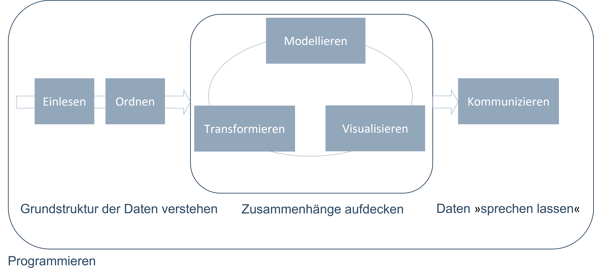
]

.right[
.font50[
Quelle: [R4DS](https://r4ds.had.co.nz/introduction.html), eigene Darstellung
]
]


---
class: clear, middle, center


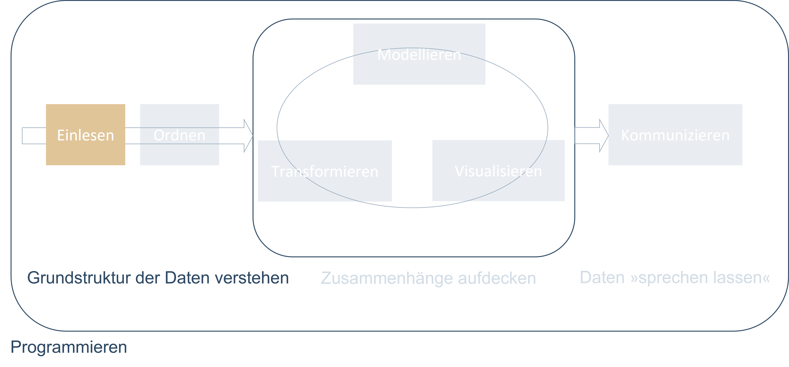

---
#Daten einlesen

+ Typischerweise entweder aus einer Datei, Datenbank oder einer Programmierschnittstelle (API).

+ Der erste Schritt ist der wichtigste: Wenn wir unsere Daten nicht in R einlesen können, können wir sie auch nicht analysieren, nicht visualisieren, nicht ...


+ Leseempfehlung: 
  + [The Tidyverse Cookbook, Kapitel 2 (Grolemund, 2020)](https://rstudio-education.github.io/tidyverse-cookbook/import.html)
  + [R4DS, Kapitel 11 (Wickham/Grolemund, 2021)](https://r4ds.had.co.nz/data-import.html)

+ Weitere Ressourcen: 
  + [Vortrag von Hadley Wickham (Video)](https://www.rstudio.com/resources/webinars/getting-data-into-r/) zum Einlesen verschiedener Datentypen.
  
---
class: clear, middle, center


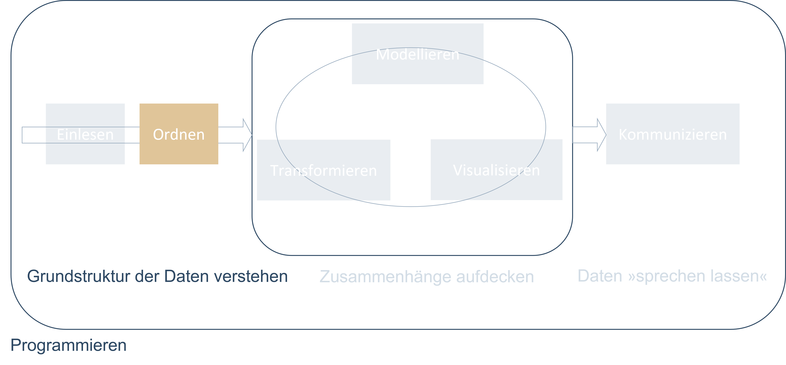


---
#Daten ordnen

+ **Ordentliche Daten** sind Daten, die in einem konsistenten Format vorliegen und zur Natur der Daten passen.

+ Das Konzept der **Tidy Data** ist für die Arbeit mit Daten essenziell.


+ Struktur ordentlicher Daten:

 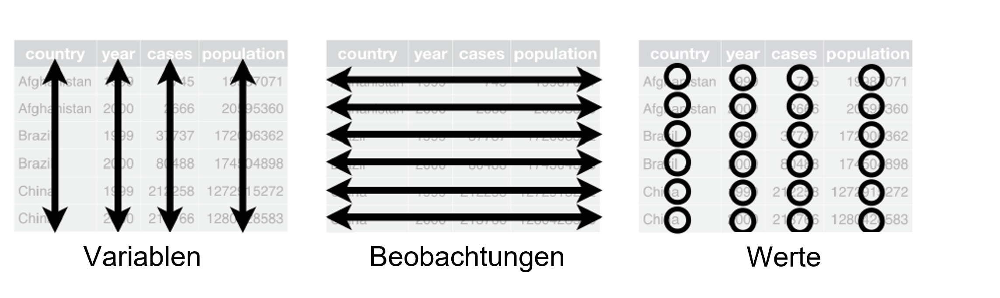


+ Leseempfehlung: [Tidy Data (Wickham, 2014)](https://www.jstatsoft.org/article/view/v059i10)

+ Die beiden ersten Schritte sind eng miteinander verknüpft:
  + Durch das richtige Einlesen der Daten kann man sich häufig viel Zeit beim Ordnen der Daten sparen.
  
---
#&raquo;Garbage in, garbage out&laquo;

+ Der Zeitaufwand, den die ersten Schritte bei einem Datenprojekt in Anspruch nehmen, sollte nicht unterschätzt werden:


.panelset[
  .panel[.panel-name[Plot]

  ]

  .panel[.panel-name[R-Code]
```{r arbeitszeitplot, fig.show='hide'}
data <- tibble(Arbeitsschritt = c("Daten einlesen", "Daten ordnen", "Daten visualisieren", 
                                "Modell auswählen", "Modell verfeinern", "Modell anwenden"),
               Zeitaufwand = c(0.19, 0.26, 0.21, 0.11, 0.12, 0.11))

data %>% 
  ggplot(aes(x = Arbeitsschritt, y = Zeitaufwand, fill = Arbeitsschritt)) +
  geom_col() +
  scale_y_continuous(labels = scales::percent_format()) +
  theme_minimal() +
  scale_fill_viridis_d() +
  theme(legend.position = "none") +
  labs(title = "Anteil der Arbeitszeit, den Data Scientists für den\njeweiligen Arbeitsschritt aufwenden",
       subtitle = "in Prozent")
``` 
  ]
]

.font50[
Quelle: [Anaconda.com](https://www.anaconda.com/state-of-data-science-2020?utm_medium=press&utm_source=anaconda&utm_campaign=sods-2020&utm_content=report), eigene Darstellung
]

---
class: clear, middle, center


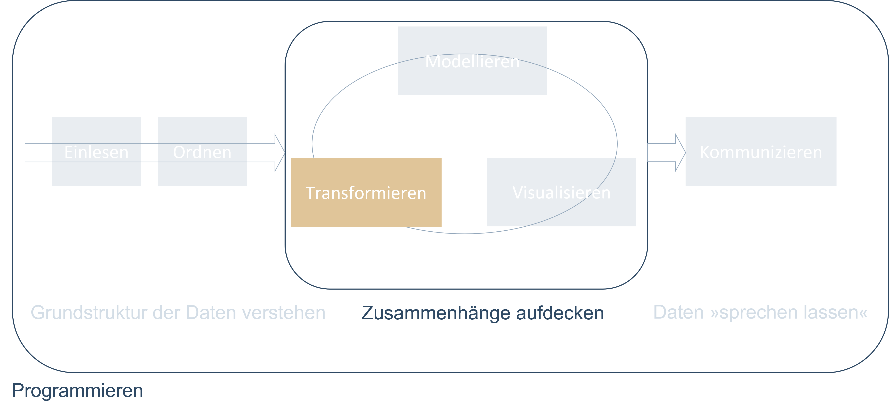

---
#Daten transformieren

+ In den seltensten Fällen kommen wir ohne die Transformation von Daten aus. (Ein Beispiel ist das vorangegangene Balkendiagramm.)

+ In der Regel ist es unsere Aufgabe, aus Daten schlau zu werden.

+ Daten können auf verschiedene Weisen transformiert werden:
  + **Fokussieren auf Beobachtungen von Interesse**: z. B. Menschen, die in einem bestimmten Land wohnen, oder Daten aus einem speziellen Jahr.
  
  + **Erstellen neuer Variablen aus bestehenden**: z. B. BIP pro Kopf aus dem gesamten Bruttoinlandsprodukt eines Landes geteilt durch die Anzahl der Einwohner.
  
  + **Berechnen zusammenfassender Statistiken**: z. B. Durchschnitte, Medianwerte oder Anteile.
  
+ Das Ordnen und das Transformieren von Daten nennt man auch **Data Wrangling**.

+ Dies ist eine Anspielung darauf, dass es ein Kampf sein kann, bis die Daten im &raquo;richtigen&laquo; Format sind.


---
class: clear, middle, center


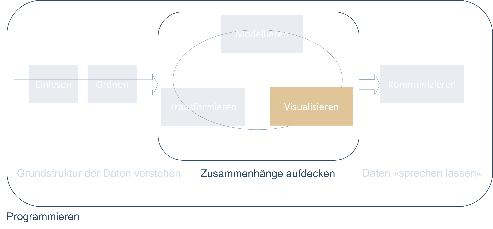


---
#.font60[&raquo;Ein Bild sagt mehr als tausend Worte.&laquo; - Daten visualisieren I
]

+ Sind die Daten im richtigen Format, gibt es zwei wesentliche Vorgehensweisen, um daraus neues Wissen zu schaffen: **Visualisierung** und **Modellierung**. Die beiden Vorgehensweisen sind komplementär.

+ Visualisierungen sind auf dem Weg zum besseren Verständnis von Daten ein unerlässliches Instrument. 

+ Eine gute Visualisierung zeigt möglicherweise unerwartete Dinge.

+ Oft zeigen uns Abbildungen, dass **irgendetwas in den Daten nicht stimmt.**

+ Sie sind deshalb ein mächtiges Instrument und sollten **immer Teil der explorativen Datenanalyse** sein.

+ R ist wegen seiner guten Visualisierungsmöglichkeiten, die auf einer **Grammar of Graphics** basieren, sehr beliebt.

+ Leseempfehlung: 
  + [R4DS, Kapitel 3 (Wickham/Grolemund, 2021)](https://r4ds.had.co.nz/data-visualisation.html)
  + [A Layered Grammar of Graphics (Wickham, 2010)](http://vita.had.co.nz/papers/layered-grammar.pdf)
  + [ggplot2: Elegant Graphics for Data Analysis (Wickham, 2021)](https://ggplot2-book.org/index.html)
  + [R Graphics Coobook (Chang, 2021)](https://r-graphics.org/)

---
#.font60[&raquo;Ein Bild sagt mehr als tausend Worte.&laquo; - Daten visualisieren II
]
.panelset[
  .panel[.panel-name[Gute Visualisierung]
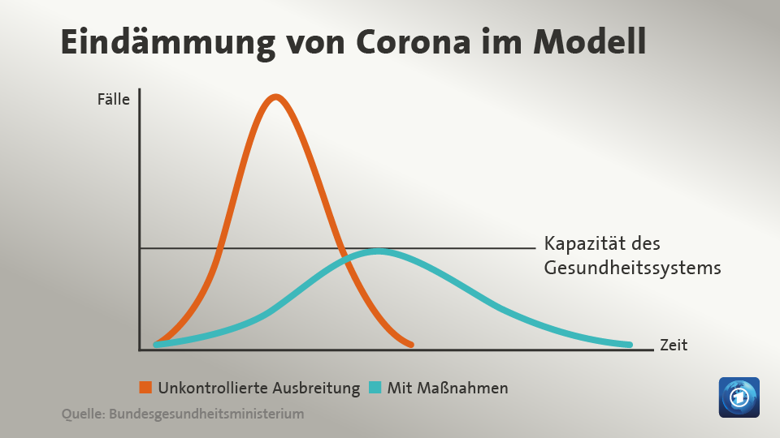
  ]
  .panel[.panel-name[Schlechte Visualisierung]
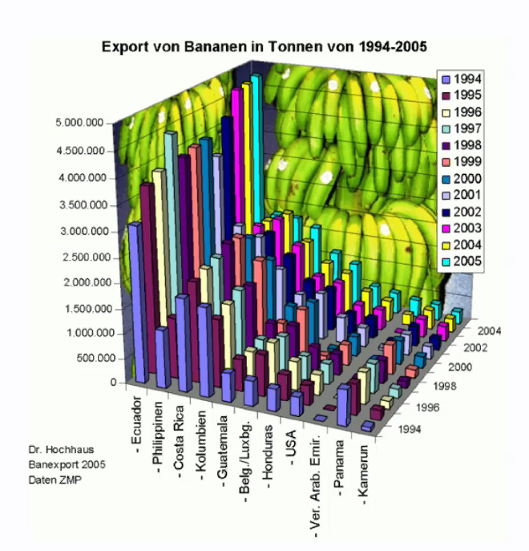
  ]
  .panel[.panel-name[Alternative zur schlechten Visualisierung]
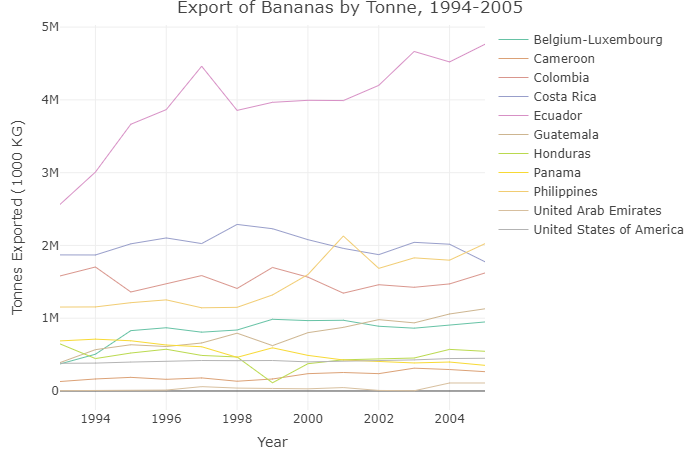
  .font50[
  Quelle: [Clarkdatalabs](https://clarkdatalabs.github.io/banana-project/R_Banana_Project/docs/ )
  ]
  ] 
  
]

---
class: clear, middle, center


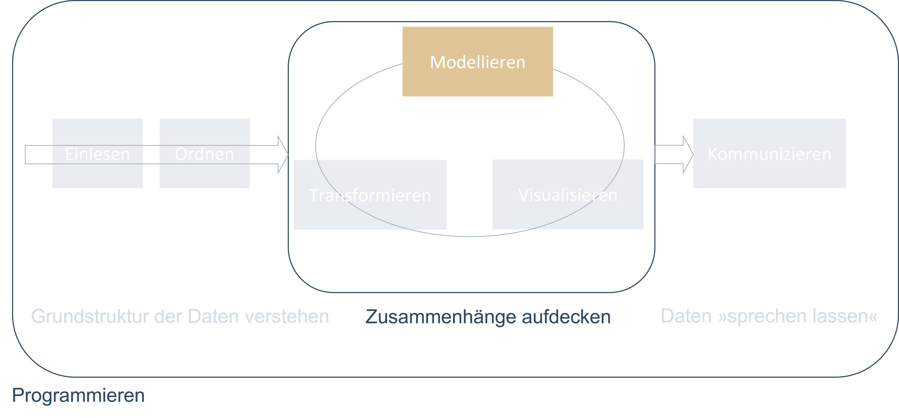

---
#Daten modellieren

+ Modelle sind komplementär zu Visualisierungen.

+ Modelle abstrahieren.

  + Ein Modell verwendet häufig die Formulierung &raquo;Wir nehmen an.&laquo;
  + Wir vereinfachen in einem Modell die Realität, um uns auf bestimmte Fragen zu konzentrieren.
  
+ Modelle sind ein wichtiger Teil der (empirischen) Wirtschaftsforschung.

+ Im Kurs schneiden wir die ökonometrische Modellierung mit R nur an.

+ Leseempfehlung:
  + [R4DS, Kapitel 22-25 (Wickham/Grolemund, 2021)](https://r4ds.had.co.nz/model-intro.html)
  
+  Weiterführende Literatur:
  + [Tidy Modeling with R (Kuhn & Silge, 2021)](https://www.tmwr.org/)

---
class: clear, middle, center


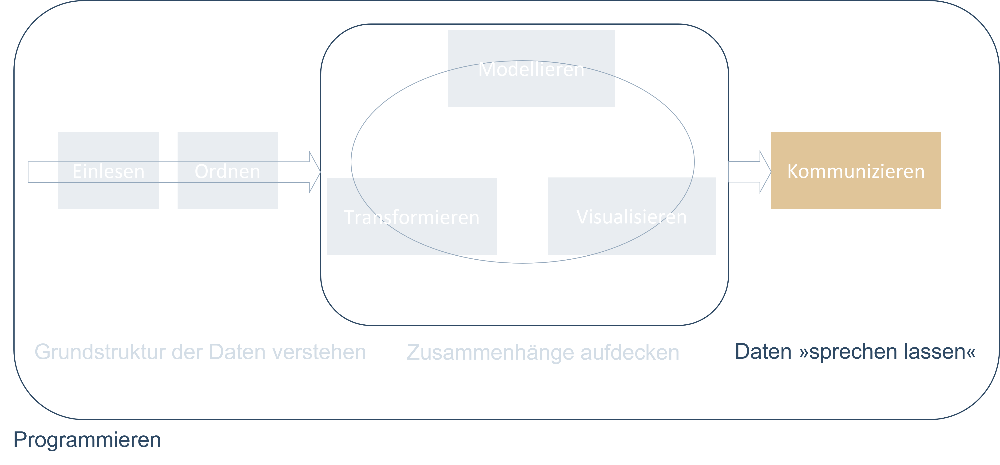


---
#Daten und Ergebnisse kommunizieren I

+ Die Kommunikation von Ergebnissen einer Datenanalyse ist mindestens so wichtig wie alle Schritte zuvor.

+ Die Datenanalyse mag bis zum Punkt der Kommunikation perfekt gewesen sein, am Ende gilt es jedoch, anderen die Ergebnisse zu vermitteln.

+ Wie man die Daten kommuniziert lässt sich nicht pauschal beantworten.

+ Es gibt jedoch fast immer Alternativen, um dieselben Ergebnisse zu kommunizieren.

+ Leseempfehlung: [R4DS, Kapitel 26-30](https://r4ds.had.co.nz/communicate-intro.html)

---
#Daten und Ergebnisse kommunizieren II

```{r include=F}
library(Ecdat)
data(Housing)

model1 <- lm(log(price) ~ ., data = Housing)
```
 
.panelset[
  .panel[.panel-name[Klassische Kommunikation]
  .font50[
```{r results='asis', echo=FALSE}
model1 %>% 
  sjPlot::tab_model()
```
]
  ]
  .panel[.panel-name[Alternative Kommunikation]
```{r results='asis', echo=FALSE, fig.width=10, fig.height=6}
model1 %>% 
  sjPlot::plot_model() + 
  ylim(0, 0.3)
```
  ]
  .panel[.panel-name[Code für beide Alternativen]
```{r eval=FALSE}
#Daten laden
library(tidyverse)
library(Ecdat)
data(Housing)
#Modell bestimmen
model1 <- lm(log(price) ~ ., data = Housing)
#Klassiche Kommunikation als Regressionstabelle
model1 %>% 
  sjPlot::tab_model()
#Alternative Kommunikation als Koeffizientenplot
model1 %>% 
  sjPlot::plot_model()
```
  ]
  
]

---
class: clear, middle, center


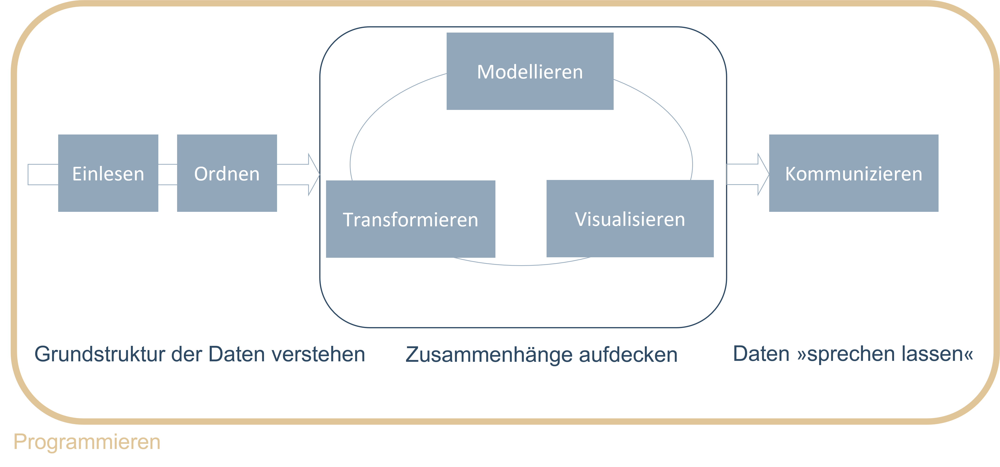


---
#Programmieren


+ Grundsätzlich muss die Datenanalyse nicht zwingend durch das Programmieren erfolgen. Man hat die Wahl zwischen dem Erlernen einer **Grafischen Benutzeroberfläche** (GUI - Graphical User Interface) oder einer **Programmiersprache**.

+ **Programmieren** bietet jedoch Vorteile gegenüber einer GUI:

  + **Reproduzierbarkeit**: Die Möglichkeit, eine Analyse nachzuvollziehen und zu reproduzieren, ist die Grundlage guter wissenschaftlicher Praxis.
  + **Automatisierung**: Befähigt uns, Datenanalyseschritte schnell zu wiederholen, falls sich etwas an der Datengrundlage ändert.
  + **Kommunikation**: Programme sind Code und Code ist Text. Text lässt sich einfach kommunizieren und teilen. Auch der Lernprozess wird dadurch vereinfacht.
  
+ Leseempfehlung:
  + [Hands-On Programming with R (Grolemund, 2014)](https://rstudio-education.github.io/hopr/)
  + [R4DS, Kapitel 17-21 (Wickham/Grolemund, 2021)](https://r4ds.had.co.nz/program-intro.html)

---

class: clear, inverse, middle, center


---

#Was ist ? I

+ R ist eine **Programmiersprache** und **kostenfreie** Software.
+ Es ist eine Umgebung, in der statistische Methoden implementiert sind.
+ R bietet standardmäßige Funktionalitäten `r fa(name = "arrow-right", fill = "black")` [&raquo;Base-R&laquo;](https://stat.ethz.ch/R-manual/R-devel/library/base/html/base-package.html)
+ Es ist mit **Packages** erweiterbar.
  + Ein Package ist eine **Sammlung von Funktionen oder Daten**.
  + Die Funktionen erweitern die Basisfunktionalität.
  + Das Paket [readxl](https://readxl.tidyverse.org/reference/excel_format.html) z. B. bietet eine Sammlung von Funktionen, um Excel-Dateien einzulesen, die nicht standardmäßig in R enthalten sind.

.split3070_right[
.font50[
   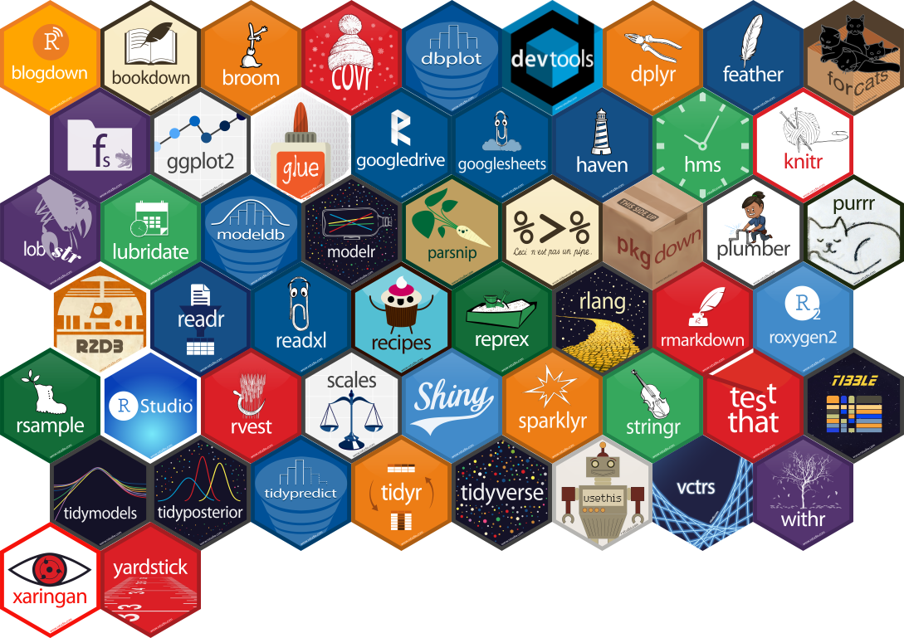
Quelle: [Mitchell O'Hara-Wild](https://www.mitchelloharawild.com/blog/hexwall/)
]
]

---

#Was ist ? II

+ Im Kern ist R ein schicker *Taschenrechner*.

--
.center[
```{r}
1+2 
```
]

--
+ Alle Rechenoperationen sind möglich:

.center[
```{r}
(1+2) / (3-4) * (5^6)
```
]


--
+ Das kann aber eben auch jeder Taschenrechner. In der Praxis arbeiten wir häufig mit Datensätzen als Input, verändern diese und generieren irgendeine Form von Output.


---

class: clear, inverse, middle, center


---

#Was ist ?

+ R ist der **Motor**, RStudio ist das **Cockpit**.
+ Wir lernen und arbeiten mit der Programmiersprache R und nutzen dafür RStudio.
+ RStudio bietet eine anwenderfreundliche **Benutzeroberfläche**, um in R zu &raquo;coden&laquo;.
+ RStudio ist grundsätzlich nicht zwingend erforderlich, macht das Arbeiten mit R aber wesentlich einfacher.
+ Die Benutzeroberfläche lässt sich recht frei, je nach persönlicher Präferenz, anpassen.

.center[
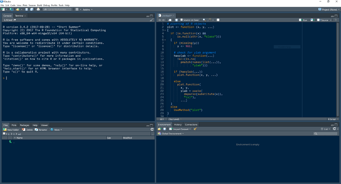
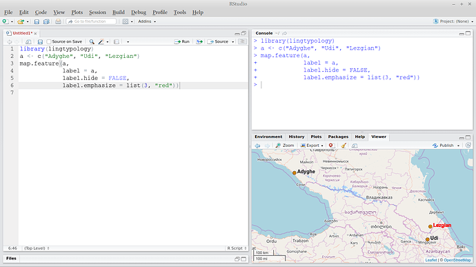
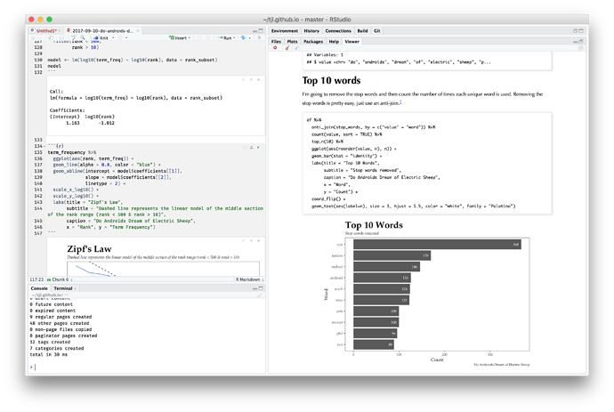
]
.font50[Quelle: [RStudio Community](https://community.rstudio.com/t/whats-your-rstudio-pane-layout/1528/6)
]

---

class: clear, inverse, middle, center

#Kursressourcen
.center[
Literatur, Tutorials und Co.
]

---
#Allgemeine Ressourcen

+ Die Zahl der Ressourcen, um R zu lernen, ist groß. Viele Ressourcen sind kostenfrei.

+ Für den Einstieg:
  + [R for Data Science (R4DS), (Wickham/Grolemund, 2021)](https://r4ds.had.co.nz/)
     + Idealer Einstieg zum Selbstlernen, viele Beispiele.
     + Weite Teile des Kurses basieren auf diesem Buch.
     + Nutzt das [Tidyverse](https://www.tidyverse.org/).

+ Für den Einstieg und darüber hinaus:
  + [Modern Data Science with R (Baumer et al., 2021)](https://mdsr-book.github.io/mdsr2e/)
     + Führt ebenfalls die wichtigsten Konzepte ein.
     + Darüber hinaus Einführung in statistische Grundlagen und Modellierung.
     + Guter Einblick in verschiedene Datentypen, z. B. Textdaten, Geodaten.
  + [Modern Statistics with R (Thulin, 2021)](http://www.modernstatisticswithr.com/)
     + Gute Einführung in die Grundlagen.
     + Fokus auf der Illustration und Anwendung statistischer Methoden mit R.

---
#Thematische Ressourcen

+ Die Themen und Probleme, mit denen sich Data Science beschäftigt, sind schier endlos.

+ Für die meisten gibt es Lösungen in R.

+ **&raquo;Das einzige Lesezeichen, das man braucht&laquo;**: [Big Book of R (Baruffa, laufend aktualisiert)](https://www.bigbookofr.com/index.html)
    + Thematische Sammlung einer Vielzahl von Büchern und Tutorials zu R.

    + Die Themen reichen von
        + &raquo;R-Internas&laquo; (vgl. Kapitel 7, 8, 19, 20, 21),
        + über Data Science und Statistik (vgl. Kapitel 9, 25),
        + bis zu einer Sammlung von Sammlungen (vgl. Kapitel 31).

+ Empfehlung: Bei der Suche nach Ressourcen sollte darauf geachtet werden, dass diese sich der **modernen Tidyverse- und Dplyr-Syntax** bedienen.

+ Leseempfehlung: 
  + [Welcome to the Tidyverse (Wickham et al., 2019)](https://joss.theoj.org/papers/10.21105/joss.01686)

---
#Die wichtigste Ressource überhaupt .font30[(...neben unserem Kurs)]

.split3070_left[

.font50[
Quelle: [tenor.com](https://tenor.com/view/jon-oliver-google-it-angry-dumb-gif-9010452)
]
]
 
--
.split3070_right[
+ ...und zwar am besten auf <b>Englisch</b>.
+ Die meisten Fragen hat sich auch schon mal jemand anderes gestellt...
+ ...und wieder jemand anderes beantwortet.
+ Für alles, was mit Code zu tun hat, landet man schnell bei [stackoverflow](https://stackoverflow.com/).
+ Eine Community, in der von Mitgliedern Fragen gestellt und beantwortet werden.
+ Je genauer man das Problem erkannt hat und je präziser man die Suche formuliert, desto eher findet man die passende Lösung:
  + Googeln von ["weighted mean in R"](https://www.google.com/search?q=weighted+mean+in+r&rlz=1C1GCEB_enDE812DE812&oq=weighte&aqs=chrome.0.69i59l2j69i57j0i67j0j69i60j69i65j69i60.959j0j4&sourceid=chrome&ie=UTF-8).
  + Googeln von ["r weighted mean by group dplyr"](https://www.google.com/search?q=r+weighted+mean+by+group+dplyr&rlz=1C1GCEB_enDE812DE812&sxsrf=ALeKk03WAsKWVl3eeqI-a2WNoOyvhttv-w%3A1626435350378&ei=Fm_xYOvMFs7isAfrtaOwBg&oq=r+weighted+mean+by+group+dplyr&gs_lcp=Cgdnd3Mtd2l6EAMyCAghEBYQHRAeMggIIRAWEB0QHjoHCAAQRxCwA0oECEEYAFCnMlj1P2CgSWgCcAJ4AIABbYgB8gKSAQMzLjGYAQCgAQGgAQKqAQdnd3Mtd2l6yAEIwAEB&sclient=gws-wiz&ved=0ahUKEwjrr7zqv-fxAhVOMewKHevaCGYQ4dUDCA4&uact=5).
]

---

class: clear, inverse, middle, center

#Organisatorisches zum Kurs
.center[
Leistungsnachweise und -voraussetzungen, Zeitplan
]


---
#Organisatorisches zum Kurs I

+ Der Kurs erfordert einen Leistungsaufwand von 2 SWS. 

+ Der Kurs teilt sich in Vorlesungs- und Übungszeiten und selbständige Eigenleistung in Form von Übungsaufgaben.

+ Im Vorlesungsteil werden Konzepte und Strukturen theoretisch eingeführt, die in den praktischen Übungsteilen vertieft werden. 

+ Die Philosophie des Kurses ist **Hands-on**. Ein großer Teil der Zeit wird deshalb auf die **praktischen Teile** verwendet werden.

+ Leistungsnachweise:
    + Präsenz 
    + Bearbeiten der Übungsaufgaben
    + Kurzpräsentation am Ende des Semesters

+ Leistungsvoraussetzungen:
  + Keine

---
#Organisatorisches zum Kurs II

##Zeitplan:
<br/>

```{r echo=F}
tibble(Datum = c("08.10.2021",
                 "22.10.2021",
                 "05.11.2021",
                 "19.11.2021",
                 "03.12.2021",
                 "17.12.2021",
                 "07.1.2021",
                 "21.1.2021"),
       Uhrzeit = rep(c("13:00 - 16:15 Uhr"), length(Datum)),
       Raum = rep(c("G-107"), length(Datum)),
       "Geplanter Kursinhalt" = c("Kursvorstellung und erste Schritte",
                                  "Datenanalyse mit dem Tidyverse",
                                  "Visualisierungen mit ggplot2",
                                  "Umgang mit unordentlichen Daten",
                                  "Zusammenführen mehrerer Datensätze, Mikrodaten",
                                  "Geodaten - R als GIS",
                                  "7. Sitzung",
                                  "8. Sitzung")) %>% 
  kableExtra::kable() %>% 
  kableExtra::kable_minimal(c("hover"), full_width = F)

```

---
#Organisatorisches zum Kurs III

> There is no way of knowing nothing about a
subject to knowing something about a subject
without going through a period of much
frustration and **suckiness**.


> **Push trough. You'll suck less.** .font50[~ Hadley Wickham - Chief Scientist bei R-Studio, Autor zahlreicher R-Pakete]

.center[
```{r results='asis', echo=FALSE, fig.width=10, fig.height=5}
r_wissen <- tibble(Zeit = rep(c(0:5), times = 2),
                    Art = c(rep("Suckiness", times = 6),
                            rep("R-Skills", times = 6)),
                    Wert = c(16,8,4,2,1,0,0,1,2,4,8,16)
                    )


r_wissen %>% 
          ggplot(aes(x = Zeit, y = Wert, fill = Art, color = Art)) +
          # geom_smooth(se = F) +
          geom_area(position = "identity", alpha = 0.6) +
          scale_fill_viridis_d() +
          scale_color_viridis_d() +
          labs(x = "Zeit / Kurseinheiten", y = "Suckiness vs. R-Skills") +
          theme_minimal() +
          theme(legend.title = element_blank(),
                axis.text = element_blank(),
                legend.text = element_text(size = 14),
                axis.title = element_text(size = 14),
                legend.position = "top") 

```
]