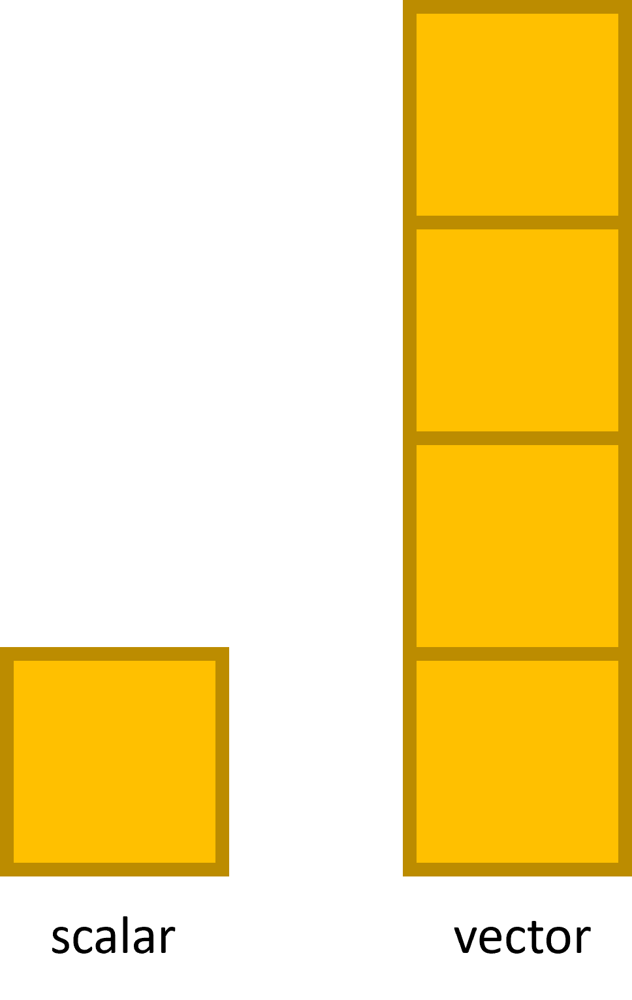

layout: true

<div class="my-footer">
  <span>&emsp;
  Pekka Sagner M.Sc.
  &emsp;&emsp;&emsp;&emsp;&emsp;&emsp;&emsp;&emsp;&emsp;&emsp;&emsp;&emsp;&emsp;
  &emsp;&emsp;&emsp;&emsp;&emsp;&emsp;&emsp;&emsp;&emsp;&emsp;&emsp;&emsp;&emsp;
  &emsp;&emsp;&emsp;&emsp;&emsp;
  Datenanalyse und -visualisierung</span> 
</div>


```{r setup, include=FALSE}
pacman::p_load(tidyverse, fontawesome, tidyverse, knitr, xaringanExtra)

options(
    htmltools.dir.version = FALSE,
    knitr.table.format = "html",
    knitr.kable.NA = ""
)
knitr::opts_chunk$set(
    warning = FALSE,
    message = FALSE,
    fig.path = "figs/",
    fig.width = 7.252,
    fig.height = 4,
    comment = "#>",
    fig.retina = 3 # Better figure resolution
)
# Enables the ability to show all slides in a tile overview by pressing "o"
xaringanExtra::use_tile_view()
xaringanExtra::use_panelset()
xaringanExtra::use_clipboard()
xaringanExtra::use_share_again()
xaringanExtra::style_share_again(share_buttons = "all")
xaringanExtra::use_extra_styles(
  hover_code_line = TRUE,
  mute_unhighlighted_code = FALSE
)
# xaringanExtra::use_logo(
#   image_url = "images/logo_print_studierende.jpg",
#   position = xaringanExtra::css_position(top = "1em", right = "1em")
# )

knitr::opts_chunk$set(warning = F, message = F) # Whether to display errors
```
 

---
#Datenanalyse und -visualisierung

## mit der Programmiersprache R

.split3070_left[

### Pekka Sagner M.Sc.

[`r fa(name = "envelope", fill = "black")` sagner@iwkoeln.de](mailto:sagner@iwkoeln.de)<br>
[`r fa(name = "user", fill = "black")` iwkoeln.de/.../pekka-sagner](https://www.iwkoeln.de/institut/personen/pekka-sagner.html)<br>
[`r fa(name = "github", fill = "black")` @pekkasagner](http://github.com/pekkasagner)

Wintersemester 2021/22

.font60[Letzte Aktualisierung:  `r format(Sys.time(), '%d. %B %Y')`
]

]

.split3070_right[
<br/><br/>
<br/><br/>

## Erste Schritte mit R und RStudio
]

```{r xaringan-logo, echo=FALSE}
xaringanExtra::use_logo(
  image_url = "images/logo_print_studierende.jpg", # top right corner
  width = "200px" 
)
```


---
#Inhalte und Ziele der Sitzung


+ Verständnis der Grundfunktionen von R und RStudio
+ Erweiterte Einstellungen
+ Erstellung eines Projekts
+ Grundverständnis verschiedener Datentypen
in R

.center[

]

.right[
.font50[
Quelle: [pickardpredictives.com](https://www.pickardpredictives.com/portfolio/3_r_basics/)
]
] 

+ Leseempfehlung: [An Introduction to R, Kapitel 1 & 2 (Douglas et al., 2021)](https://intro2r.com/chap1.html)


---
class: clear, inverse, middle, center

#Wieso, weshalb, warum?

---
#Was ist R überhaupt?

.split3070_left[

]


.split3070_right[
+ Die Antwort kommt stark darauf an, wen man fragt.
+ Grundsätzlich ist R eine **Umgebung für statistische Berechnungen, Grafiken und Programmierung**.
+ Erschaffen wurde das Programm von Ross Ihaka und Robert Gentleman (1996).
+ Betreut wird das Projekt vom *R Core Team*.
+ Darüber hinaus steuern viele weitere Entwickler Funktionalitäten bei.
+ Weitere Informationen unter [r-project.org](https://www.r-project.org/).
]

.center[

]

---
#Warum R?

+ R ist **Open Source** und leicht zugänglich.

+ R steht für Windows, Mac und Linux zur Verfügung.

+ R bietet ein breites Spektrum an Funktionalitäten für statistische Analysen.

+ R bietet sehr flexible grafische Gestaltungsmöglichkeiten, mit denen sich
**publikationsreife Abbildungen** erstellen lassen.

+ Die Funktionalitäten von R werden durch stetig (neu-)entwickelte **Pakete** erweitert.

+ R hat eine große (Online-)**Community**, zahlreiche Lernressourcen - sehr viele davon sind kostenfrei.

+ Diese und weitere Gründe machen R sowohl in der Wirtschaft als auch in der Forschung beliebt [(Muenchen, 2019)](http://r4stats.com/articles/popularity/).

---
class: clear, inverse, middle, center

#Installation von R und RStudio

---
#R und RStudio

+ Im Kurs nutzen wir R und RStudio.
+ Unsere Berechnungen, Abbildungen und so weiter werden alle mit R erstellt. 
+ RStudio bietet eine komfortable Benutzeroberfläche, um Ergebnisse anzuzeigen und mit R zu arbeiten.
+ Die Arbeit mit R wird durch RStudio **deutlich benutzerfreundlicher** und dadurch nicht zuletzt auch einfacher.


.center[

]


---
#Installation von R und RStudio

+ Es muss **zuerst** R **und dann** RStudio installiert werden.

+ R ist für Windows, Mac und Linux verfügbar unter: [cloud.r-project.org](https://cloud.r-project.org/).

+ Rstudio steht unter [rstudio.com](https://www.rstudio.com/products/rstudio/download/) zum Download bereit. Für Privatanwender bietet sich die kostenfreie RStudio Desktop Version an.

+ Aus der Motor/Cockpit-Analogie folgt auch, dass wir nie die R-Anwendung direkt starten, sondern immer RStudio.

.center[

]


---
class: clear, inverse, middle, center

#Benutzeroberfläche von RStudio


---
#.font80[Orientierung auf der Benutzeroberfläche von RStudio]

.panelset[
  .panel[.panel-name[Console]


+ In der Console evaluiert R den Code.
+ Man kann Code direkt in der Console schreiben und mit Enter ausführen.
  ]
  .panel[.panel-name[Skripte (Source Oberfläche)]

.font80[
+ Zum Speichern von Code wird dieser in R-Skripten geschrieben.
+ R-Skripte sind lediglich Textdateien mit einer **.R**-Dateiendung.
+ Ein neues R-Skript wird über die Menüleiste (**File** &#8594; **New File** &#8594; **R Script**) oder über den Tastatur-Shortcut **Strg + Umsch. + N** geöffnet.
+ Code wird über den Run-Button oder mit **Strg + Enter** ausgeführt.
    ]
  ]
  .panel[.panel-name[Environment und Co.]

  .font80[
+ Das Environment zeigt uns gespeicherte Objekte.
+ Die anderen Tabs zeigen weitere interessante Informationen, wie z.B. die Dateistruktur.
    ]
  ]
  .panel[.panel-name[Plots und Viewer]

  .font80[
+ Im Plot-Fenster werden Abbildungen angezeigt. 
+ Der Viewer kommt z.B. bei interaktiven Abbildungen zum Einsatz.
+ Das History-Fenster zeigt die Historie der ausgeführten Codezeilen.
    ]
  ]
  ] 
  
---
class: clear, inverse, middle, center

#Arbeiten mit Skripten und Projekten

---
#Skripte und Projekte

+ Skripte sind einfache Textdateien, die unseren R-Code und Kommentare enthalten. Sie haben die Dateiendung **.R**.

+ Die Dokumentation der Datenanalyse in Skripten ist entscheidend für die Reproduzierbarkeit unserer Arbeit.

+ Für die Organisation der Datenanalyse bietet RStudio die Möglichkeit, **Projekte** zu erstellen. Diese haben die Dateiendung **.Rproj**.
  
+ Jedes Analyseprojekt sollte in einem eigenen Projekt durchgeführt werden.

+ Wir werden später ein eigenes Projekt für die erste Übungsstunde anlegen.

+ Jeder Übungstermin, an dem wir mit R arbeiten wird mit einem eigenen R-Projekt assoziiert.

---
class: clear, inverse, middle, center

#Mathematische Operatoren

---
#Mathematische Operatoren

+ Im Kern ist R ein (semi-)schicker Taschenrechner.

+ Alle klassischen Rechenoperationen sind möglich:

> `+` Addition

> `-` Subtraktion

> `*` Multiplikation

> `/` Division

> `^` Potenzen
 
+ Darüber hinaus stehen zahlreiche Hilfsfunktionen zur Verfügung, z.B.: `mean()`, `median()`, `min()`, `max()`, `sd()` für das arithmetische Mittel, den Median, das Minimum, das Maximum und die Standardabweichung.

---
#Mathematische Operatoren
## Ein einfaches Beispiel:

+ Stellen wir uns vor, wir wollen aus dem BIP eines Landes und der Zahl der Einwohner das BIP pro Kopf berechnen.

```{r echo=F, message=F, warning=F}
library(tidyverse)
tibble(BIP = format(1000000, scientific = F), Einwohner = 5000) %>% 
  kableExtra::kable()
```

+ Teilen des BIPs durch die Einwohnerzahl ergibt das gewünschte Ergebnis. In R schreiben wir:

.center[
.details[
```{r}
1000000 / 5000
```
]
]
  
---
#Mathematische Operatoren 
## Ein einfaches Beispiel: 
  
+ Mathematische Operatoren können natürlich beliebig gemischt werden:

```{r echo=F, message=F, warning=F}
tibble(Land = c("FantasiAland",
                "FantasiBland"),
      BIP = c(format(1000000, scientific = F), 
               format(2000000, scientific = F)), 
      Einwohner = c(5000,
                    6250)) %>% 
  kableExtra::kable()
```

+ Der bevölkerungsgewichtete Durchschnitt des BIPs pro Kopf der beiden Länder liegt zum Beispiel bei:

.center[
.details[
```{r}
1000000 / 5000 * (5000 / (5000 + 6250)) + 2000000 / 6250 * (6250 / (5000 + 6250)) 
```
]
]

---
class: clear, inverse, middle, center

#R Objekte

---
#R Objekte

+ Objekte lassen sich als gespeicherte Informationen interpretieren. Dies können einfache Zahlen sein, aber auch Abbildungen oder Tabellen.

+ Sobald ein Objekt gespeichert wurde, können wir es jederzeit wieder aufrufen.

> .font150[Everything in R is an **object**.] .font80[~ John M. Chambers, Entwickler von R]

+ Objekte werden mit dem *assignment operator* einem Namen zugewiesen.

+ Assignment operator:
.center[.font200[.fontred[
<- ]]
] 

+ Die Syntax ist dann also:
.center[
```{r eval=F}
Name <- Objekt 
``` 
]

---
#R Objekte
##Ein einfaches Beispiel

+ Unser BIP pro Kopf Beispiel auf Basis von Objekten:

.center[
```{r}
bip <- 1000000
einwohner <- 5000
```
]

+ Schreibt man lediglich die jeweiligen Objektnamen in eine Zeile und führt diese aus, so wird das zugehörige Objekt angezeigt, in diesem Fall die beiden Zahlen:

.center[
.details[
```{r}
bip
```
]
]

.center[
.details[
```{r}
einwohner
```
]
]

---
#R Objekte
##Ein einfaches Beispiel

+ Mit den Objekten kann dann gerechnet werden:

.center[
```{r}
bip_pro_kopf <- bip / einwohner
```
]

+ Das Ergebnis ist dann:

.center[
.details[
```{r}
bip_pro_kopf
```
]
]
 
---
# Noch mehr Operatoren

+ Neben mathematischen Operatoren gibt es in R auch **logische Operatoren**.

+ Logische Operatoren werden für logische Tests genutzt.

+ Logische Operatoren können nur zwei Ergebnisse liefern: *wahr* oder *falsch*. 

+ Oder in der R-Syntax: `TRUE` oder `FALSE`.

---
class: clear, inverse, middle, center

#Logische Operatoren

---
#Logische Operatoren

+ Zuerst erstellen wir einige weitere Objekte, um mit diesen logische Tests durchzuführen: 

.center[
```{r}
FantasiAland <- 1000000
FantasiBland <- 1100000
FantasiCland <- 1020000
FantasiDland <- 3100000
FantasiEland <- 1000000
```
]

+ Logische Tests sind Vergleiche:

.font70[
```{r echo=F, message=F, warning=F}
tibble(`Logischer Operator` = c("==",
                  "!=",
                ">",
                "<",
                ">=",
                "<="),
      Bedeutung = c("ist gleich",
              "ist nicht gleich",
              "ist größer",
              "ist kleiner",
              "ist größer oder gleich",
              "ist kleiner oder gleich")) %>% 
  kableExtra::kable()
```
]

---
#Logische Operatoren

+ `==` evaluiert, ob zwei Werte gleich sind. Dies müssen keine Zahlen sein. 

+ Der untenstehende Code testet folgende Beziehung: Das BIP in FantasiAland ist gleich groß wie in FantasiCland.

.center[
.details[
```{r}
FantasiAland == FantasiCland
```
]
]

+ Da die beiden Werte nicht gleich sind, ist die Antwort `FALSE`.

+ Zur Erinnerung: Statt mit den Objekten zu rechnen, könnten wir auch einfach die Zahlenwerte verwenden:

.center[
.details[
```{r}
1000000 == 1020000
```
]
]

---
#Logische Operatoren

+ `!=` evaluiert, ob zwei Werte nicht gleich sind.

+ Der nachfolgende Code testet folgende Beziehung: Das BIP in FantasiAland ist nicht gleich groß wie in FantasiCland.

.center[
.details[
```{r} 
FantasiAland != FantasiCland
```
]
]  

+ Da die beiden Werte nicht gleich sind, ist die Antwort `TRUE`.

---
#Logische Operatoren kombinieren

+ Logische Operatoren lassen sich mit `&` und `|` beliebig untereinander kombinieren.


.font90[
```{r echo=F, message=F, warning=F}
tibble(`Logischer Operator` = c("&",
                  "|"),
      Bedeutung = c("und",
              "oder")) %>% 
  kableExtra::kable()
```
]

+ Falls uns interessiert ob **beide Aussagen** korrekt sind, nutzen wir `&`.

+ Ob eine Kombination sinnhaftig ist, bleibt unsere Entscheidung.

+ Denn `1000000 > 1020000 & 1000000 < 1020000` ist ein zulässiger logischer Test. Mit Objekten:

.center[
.details[
```{r} 
FantasiAland > FantasiCland & FantasiAland < FantasiCland
```
]
]  

---
#Logische Operatoren kombinieren

+ Falls uns interessiert, ob **mindestens eine von beiden Aussagen** stimmt, schreiben wir:

.center[
.details[
```{r} 
FantasiAland > FantasiCland | FantasiAland < FantasiCland
```
]
]  

+ Auch die logischen Operatoren können beliebig häufig verkettet werden:

.center[
.details[
```{r} 
(FantasiAland > FantasiCland | FantasiAland < FantasiCland) & FantasiDland == FantasiEland
```
]
]  

---
#Noch mehr Objekte

+ Bisher haben wir mathematische und logische Operatoren kennengelernt und erste Objekte erstellt.

+ Die Objekte bisher enthielten allerdings jeweils nur eine Zahl (Skalare).

+ R kann natürlich noch viel mehr.

+ Objekte können jegliche Art von Datentypen enthalten.

+ Wir schauen uns als Nächstes die häufigsten Daten**typen** in R an.

+ Auf dem Weg erstellen wir **Vektoren**, nach den Skalaren, die nächst komplexere Daten**struktur** in R.

---
class: clear, inverse, middle, center

#Vektoren

---
#Vektoren

.pull-left[
+ Vektoren sind Matrizen der Dimension $n\times1$ (bedeutet $n$ Zeilen und $1$ Spalte).

+ Um in R einen Vektor zu erstellen, nutzen wir die Funktion `c()` (steht für *concatenate* [verketten]).

+ Beispiel mit Zahlen:

.details[
```{r}
c(1, 100, 1000, 10000)
```
]

+ Beispiel mit Text:


.details[
```{r}
c("Hallo", "ich", "bin", "ein", "Text")
```
]
]

.pull-right[
.center[

]
]

---
#Vektoren

+ Wir können unsere zuvor erstellten BIPs, die wir einzelnen Objekten zugewiesen haben, verbinden.

.center[
```{r}
alle_bips <- c(FantasiAland, FantasiBland, FantasiCland, 
               FantasiDland, FantasiEland)
```
]

+ Es entsteht ein Vektor, der die BIPs der fünf Länder enthält:

.center[
.details[
```{r}
alle_bips
```
]
]

---
#Vektoren

+ Mit Vektoren kann man rechnen:

.center[
.details[
```{r}
alle_bips / 5000
```
]
]

+ Und wir können logische Tests durchführen:

.center[
.details[
```{r}
alle_bips == FantasiAland
```
]
]

+ Zur Erinnerung: Die vergebenen Namen für die Objekte sind für logische Tests irrelevant. Es kommt darauf an, welche Inhalte hinter den jeweiligen Namen stecken.


---
#Datentypen

+ Datenstrukturen können verschiedene Datentypen enthalten.

+ Zu den relevantesten Datentypen in R gehören die folgenden:

.font90[
```{r echo=F, message=F, warning=F}
tibble(Datentyp = c("double",
                  "integer",
                  "logical",
                  "character",
                  "factor"),
      Beispiel = c("3.1, 7.9, 10.3",
              "1, 2, 3, 4",
              "TRUE oder FALSE",
              "hallo, ich bin, ein text",
              "divers, frau, mann"),
      Hinweis = c("numeric", 
                  "numeric",
                  "-",
                  "strings/text",
                  "numeric/character/logical")) %>% 
  kableExtra::kable()
```
]

---
#Datentypen

.font80[
+ Beispielvektoren:

.center[
```{r}
vect_double <- c(3.1, 7.9, 10.3)
vect_integer <- c(1L, 2L, 3L)
vect_logical <- c(TRUE, FALSE, TRUE, TRUE)
vect_character <- c("strings", "text", "character")
vector_factor <- factor(c("divers, frau, mann"))
```
]

+ Wir können die Datentypen mit der Funktion `typeof()` überprüfen, z. B.:

.center[
.details[
```{r}
typeof(vect_double)
```
]
]

+ Oder:

.center[
.details[
```{r}
typeof(vect_character)
```
]
]

]
---
#Datentypen 

+ Es kommt gelegentlich vor, dass wir einen Datentyp erzwingen wollen.

+ Das ist z. B. hilfreich, wenn beim Einlesen der Daten, der Datentyp nicht korrekt erkannt wurde.

+ Wir nutzen hierfür die `as. ...()`-Funktionen.

> `as.numeric()`

> `as.character()`

> `as.factor()`

> ...

---
#Datentypen 

+ Insbesondere die Funktion `as.factor()` nutzen wir häufiger.

+ Faktoren sind eigentlich eine Daten**klasse** und kein Daten**typ**. Die Funktion `as.factor()` wandelt verschiedene Datentypen um. Sie werden dadurch zum Typ `integer` aber zur Klasse `factor`.

.font70[
+ Ausgangspunkt:
.center[
.details[
```{r}
typeof(vect_character)
```
]
]

+ Datentyp:
.center[
.details[
```{r}
vect_character_to_vector <- as.factor(vect_character)
typeof(vect_character_to_vector)
```
]
]
+ Datenklasse:
.center[
.details[
```{r}
class(vect_character_to_vector)
```
]
]

]

---
#Datentypen

+ Braucht man das wirklich?

+ Ja.

+ Sind Datentypen kompliziert? 

+ Nein.

+ Die gute Nachricht: **Oft funktioniert es einfach wie es soll.**

+ Im Moment stehen diese noch im leeren Raum. Bei der Arbeit mit Datensätzen und Visualisierungen wird uns klarer, welche Funktionsweisen welcher Datentyp bedingt.

---
class: clear, inverse, middle, center

#Genug der Theorie. Ab nach .  