layout: true

<div class="my-footer">
  <span>&emsp;
  Pekka Sagner M.Sc.
  &emsp;&emsp;&emsp;&emsp;&emsp;&emsp;&emsp;&emsp;&emsp;&emsp;&emsp;&emsp;&emsp;
  &emsp;&emsp;&emsp;&emsp;&emsp;&emsp;&emsp;&emsp;&emsp;&emsp;&emsp;&emsp;&emsp;
  &emsp;&emsp;&emsp;&emsp;&emsp;
  Datenanalyse und -visualisierung</span> 
</div>


```{r setup, include=FALSE}
pacman::p_load(tidyverse, fontawesome, tidyverse, knitr, xaringanExtra)

options(
    htmltools.dir.version = FALSE,
    knitr.table.format = "html",
    knitr.kable.NA = ""
)
knitr::opts_chunk$set(
    warning = FALSE,
    message = FALSE,
    fig.path = "figs/",
    fig.width = 7.252,
    fig.height = 4,
    comment = "#>",
    fig.retina = 3 # Better figure resolution
)
# Enables the ability to show all slides in a tile overview by pressing "o"
xaringanExtra::use_tile_view()
xaringanExtra::use_panelset()
xaringanExtra::use_clipboard()
xaringanExtra::use_share_again()
xaringanExtra::style_share_again(share_buttons = "all")
xaringanExtra::use_extra_styles(
  hover_code_line = TRUE,
  mute_unhighlighted_code = FALSE
)
# xaringanExtra::use_logo(
#   image_url = "images/logo_print_studierende.jpg",
#   position = xaringanExtra::css_position(top = "1em", right = "1em")
# )

knitr::opts_chunk$set(warning = F, message = F) # Whether to display errors
```
 

---
#Datenanalyse und -visualisierung

## mit der Programmiersprache R

.split3070_left[

### Pekka Sagner M.Sc.

[`r fa(name = "envelope", fill = "black")` sagner@iwkoeln.de](mailto:sagner@iwkoeln.de)<br>
[`r fa(name = "user", fill = "black")` iwkoeln.de/.../pekka-sagner](https://www.iwkoeln.de/institut/personen/pekka-sagner.html)<br>
[`r fa(name = "github", fill = "black")` @pekkasagner](http://github.com/pekkasagner)

Wintersemester 2021/22

.font60[Letzte Aktualisierung:  `r format(Sys.time(), '%d. %B %Y')`
]

]

.split3070_right[
<br/><br/>
<br/><br/>

## Einführung in das Tidyverse
]

```{r xaringan-logo, echo=FALSE}
xaringanExtra::use_logo(
  image_url = "images/logo_print_studierende.jpg", # top right corner
  width = "200px" 
)
```


---
#Inhalte und Ziele der Sitzung

+ Erweiterbarkeit von R mit Paketen
+ Moderne Syntax für die Datenanalyse
+ Verständnis der häufigsten Schritte bei der Datenmanipulation
+ Verständnis **ordentlicher** Datenstrukturen

.center[
 
]

.right[
.font50[
Quelle: [github/rstudio.com](https://github.com/rstudio/hex-stickers/blob/master/SVG/tidyverse.svg)
]
] 

+ Leseempfehlung: [Tidyverse Cookbook (Grolemund, 2020)](https://rstudio-education.github.io/tidyverse-cookbook/)


---
class: clear, inverse, middle, center

# Pakete


---
#Pakete I

+ Die Basisfunktionalität von R wird durch Pakete erweitert.

+ Pakete enthalten Funktionen und/oder Objekte (z. B. Datensätze).

+ Pakete in R kann man sich wie einen Werkzeugkasten vorstellen.

+ Bevor man ein Werkzeug nutzen kann, muss man den Werkzeugkasten jedoch erst **ein Mal** anschaffen.

.pull-left[
.center[
`install.packages()` 
<br/>

<br/>
&raquo;Werkzeugkasten kaufen&laquo;
<br/>
**&rarr; Ein Mal**
]
]
.pull-right[
.center[
`library()`
<br/>

<br/>
&raquo;Werkzeug benutzen&laquo; 
<br/>
**&rarr; Zu Beginn jeder neuen R-Sitzung**
]
]

---
#Pakete II

+ Pakete werden mit der Funktion `install.packages()` installiert. Der Paketname steht in Anführungszeichen, z. B.:

```{r eval=F}
install.packages("beispielpaket")
```

+ Um die Funktionen aus dem Paket **beispielpaket** in der Datenanalyse zu nutzen, muss dieses Paket nach der einmaligen Installation geladen werden. 

+ Pakete werden mit der Funktion `library()` geladen. Hier muss der Paketname nicht in Anführungsstrichen stehen, z. B.:

```{r eval=F}
library(beispielpaket)
```

+ Die in der Datenanalyse benötigten Pakete werden gesammelt zu Beginn des R-Skripts geladen.


---
class: clear, inverse, middle, center

# Das Tidyverse


---
# Was ist das Tidyverse?

+ Die Autoren des Tidyverse beschreiben es so:

> Das tidyverse ist eine Sammlung von R-Paketen, die für die Data Science entwickelt wurden. Alle Pakete teilen eine zugrunde liegende Design-Philosophie, Grammatik und Datenstrukturen.

+ Für jeden der klassischen Schritte eines Datenanalyseprojekts gibt es nützliche Funktionen aus dem Tidyverse.
.center[

] 

+ Das Tidyverse legt großen Wert auf eine gute (Menschen-)Lesbarkeit des Codes.

+ Das macht Coden intuitiv und leichter zugänglich.

---
#.font80[Grundlegendes Prinzip: ordentliche Daten (*tidy data*)]
####Die drei Bedingungen für ordentliche Daten:


.left-column[
.right[
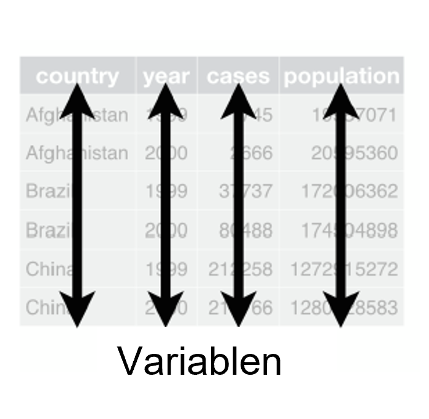
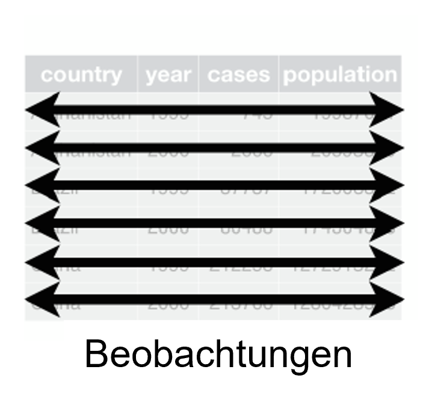
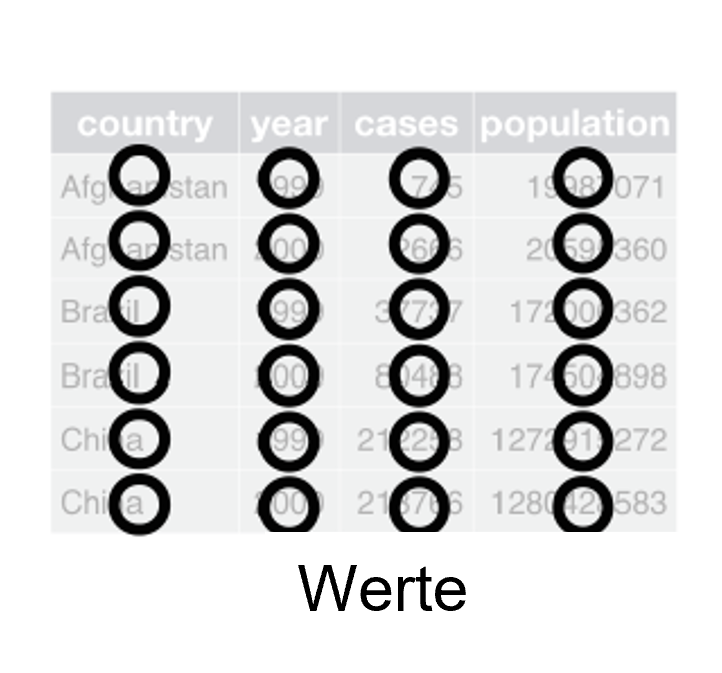

]
]

.right-column[
<br/>
<br/>
### Jede Variable in einer eigenen Spalte.
<br/>
<br/>
### Jede Beobachtung in einer eigenen Zeile.
<br/>
<br/>
### Jeder Wert in einer eigenen Zelle.
]


---
#.font80[Grundlegendes Prinzip: ordentliche Daten (*tidy data*)]

.pull-left[
+ **Jede Variable in einer eigenen Spalte.**
+ Jede Beobachtung in einer eigenen Zeile.
+ Jeder Wert in einer eigenen Zelle.

###Was stimmt hier nicht?

+ Hier stehen die beiden Länder in getrennten Spalten.
+ Der Wert in den Zellen beschreibt das BIP.
]
.pull-right[
Beispiel **dirty**:
```{r echo=F}
tibble(land_a = c(format(1000000, scientific = F)), land_b = c(1100000)) %>% 
  kableExtra::kable()
```
]

.pull-left[
###Lösung
+ In der Variable (Spalte) `land` werden die Namen der Länder aufgelistet.
+ In der Variable `bip` werden die zugehörigen Werte der BIPs eingetragen.
]


.pull-right[
Beispiel **tidy**:
```{r echo=F}
tibble(land = c("a", "b"), bip = c(format(1000000, scientific = F), format(1100000, scientific = F))) %>% 
  kableExtra::kable()
```
]

---
#.font80[Grundlegendes Prinzip: ordentliche Daten (*tidy data*)]

.pull-left[
+ Jede Variable in einer eigenen Spalte.
+ **Jede Beobachtung in einer eigenen Zeile.**
+ Jeder Wert in einer eigenen Zelle.

###Was stimmt hier nicht?

+ Sowohl bei der Variable `bip` als auch `land` sind zwei Werte eingetragen.
]

.pull-right[
Beispiel **dirty**:
```{r echo=F}
tibble(land = c("a, b"),
       bip = c("1000000, 1100000")) %>% 
  kableExtra::kable()
```
]

.pull-left[
###Lösung
+ Jeder Beobachtung (hier: `land`) wird eine eigene Zeile zugewiesen.
]

.pull-right[
Beispiel **tidy**:
```{r echo=F}
tibble(land = c("a", "b"), bip = c(format(1000000, scientific = F), format(1100000, scientific = F))) %>% 
  kableExtra::kable()
```
]


---
#.font80[Grundlegendes Prinzip: ordentliche Daten (*tidy data*)]

.pull-left[
+ Jede Variable in einer eigenen Spalte.
+ Jede Beobachtung in einer eigenen Zeile.
+ **Jeder Wert in einer eigenen Zelle.**

###Was stimmt hier nicht?

+ Die Variable `bip/einwohner` enthält zwei Werte, die durch `/` getrennt sind.
]

.pull-right[
Beispiel **dirty**:
```{r echo=F}
tibble(land = c("a", "b"),
       `bip/einwohner` = c("1000000/5000", "1100000/6250")) %>% 
  kableExtra::kable()
```
]

.pull-left[
###Lösung
+ Die Werte der Variable `bip/einwohner` werden aufgeteilt und den Variablen `bip` und `einwohner` zugewiesen.
+ Bei Bedarf kann nun z. B. das BIP pro Kopf bestimmt werden (hier: `bip_pro_kopf`).
]

.pull-right[
Beispiel **tidy**:
```{r echo=F}
tibble(land = c("a", "b"), 
       bip = c(format(1000000, scientific = F), format(1100000, scientific = F)),
       einwohner = c(5000, 1100000),
       bip_pro_kopf = c(200, 176)) %>% 
  kableExtra::kable() %>% 
  kableExtra::column_spec(4, background = "gray")

```
]

---
#.font80[Grundlegendes Prinzip: ordentliche Daten (*tidy data*)]


.center[

.font50[Quelle: [Allison Horst](https://www.openscapes.org/blog/2020/10/12/tidy-data/)]
]

+ Leseempfehlungen:
    + [Data Organization in Spreadsheets (Broman/Woo ,2018)](https://www.tandfonline.com/doi/full/10.1080/00031305.2017.1375989)
    + [Tidy Data (Wickham, 2014)](https://www.jstatsoft.org/article/view/v059i10)

---
#Installation und Laden des Tidyverse
+ Das Tidyverse besteht aus einer Sammlung von Paketen.

+ Wir installieren es **ein Mal** mit dem Befehl:

```{r eval=FALSE}
install.packages("tidyverse")
```

+ Wir werden dieses Paket in Zukunft **zu Beginn jeder Datenanalyse** laden:

```{r eval=F}
library(tidyverse)
```

---
#Die Datenstruktur im Tidyverse 

+ Eine Tabelle heißt im Tidyverse **tibble**.

.pull-left[
.center[

]
]
.pull-right[
.center[
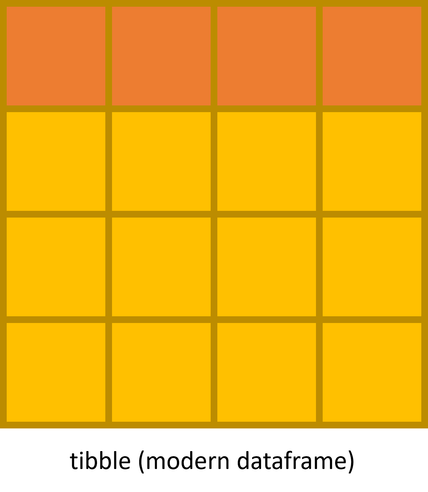
]
]
+ Ein Unterschied zu Skalaren und Vektoren ist die Kopfzeile, die den Variablennamen enthält.
+ Es gibt auch **tibbles**, die nur eine Spalte und mehrere Zeilen oder sogar nur eine Spalte und eine Zeile enthalten.
+ Die Regel sind jedoch Tabellen mit mehreren Spalten (Variablen) und mehreren Zeilen (Beobachtungen).

---
#Tibbles selbst erstellen

+ Tibbles sind Kombinationen aus Vektoren, denen wir einen Namen zuweisen. z. B.:


```{r tidy=T}
land_bip_einwohner <- tibble(land = c("FantasiAland", "FantasiBland", "FantasiCland"),
       bip = c(1000000, 1100000, 1020000),
       einwohner = c(5000, 6250, 4000),
       kontinent = c("EurAsien", "EurAsien", "EurBsien"))

land_bip_einwohner
```

+ In der Konsole werden uns interessante Hinweise zum **tibble** angezeigt, z. B. die Dimension (hier: `3x3`) und die Variablentypen (hier: `character` und `double`).

+ Im Environment werden **tibbles** als Objekttyp `tbl_df` angezeigt.

---
class: clear, inverse, middle, center

#Data Wrangling
.center[
(Daten bändigen)
]
 
.font50[Quelle: [Allison Horst](https://www.openscapes.org/blog/2020/10/12/tidy-data/)]


---
# Fünf Verben für die Datenanalyse

+ Die grundlegenden Schritte der Datenanalyse können mit **fünf Verben** durchgeführt werden.

.left-column[

.font50[Quelle: [rstudio/hex-stickers](https://github.com/rstudio/hex-stickers/blob/master/SVG/dplyr.svg)]
]

.right-column[
> `mutate()`: fügt neue Variablen hinzu, diese können auf vorhandenen Variablen basieren.

> `select()`: wählt Variablen auf Basis der Namen aus.

> `filter()`: filtert Beobachtungen auf Basis ihrer Werte.

> `summarise()`: fasst mehrere Werte zu einem einzelnen komprimierten Wert zusammen.

> `arrange()`: verändert die Reihenfolge der Zeilen.

+ Hinzu kommt:

>`group_by()`: in Kombination mit einem der obigen Verben, können Operationen **je Gruppe** ausgeführt werden.
]

---
# Fünf Verben für die Datenanalyse
##`mutate()`

.left-column-reverse[
+ Das erste Element, das den fünf Verben (Funktionen) übergeben werden muss, ist ein **tibble**.
+ `mutate` wird als zweites Element ein Variablenname und eine Funktion übergeben, z. B.:


```{r}
mutate(land_bip_einwohner, bip_pro_kopf = bip/einwohner)
```
]

.right-column-reverse[
Stilisierte Funktionsweise:
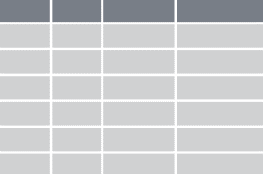
.center[.font200[&darr;]] 
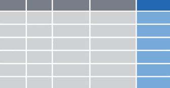
]

---
# Fünf Verben für die Datenanalyse
##`select()`

.left-column-reverse[

+ `select` wird als zweites Element ein Vektor mit Variablennamen übergeben, z. B.:


```{r}
select(land_bip_einwohner, c(land, einwohner))
```
]

.right-column-reverse[
Stilisierte Funktionsweise:
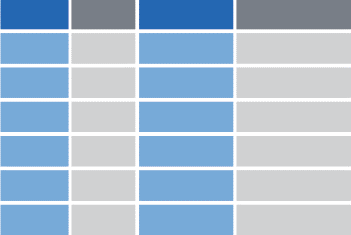
.center[.font200[&darr;]] 
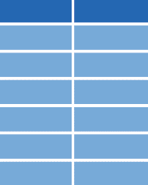
]


---
# Fünf Verben für die Datenanalyse
##`filter()`

.left-column-reverse[

+ Im Falle von `filter()` folgt als zweites Argument ein logischer Test, z. B.:


```{r}
filter(land_bip_einwohner, bip > 1000000)
```
]

.right-column-reverse[
Stilisierte Funktionsweise:
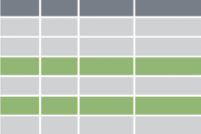
.center[.font200[&darr;]] 
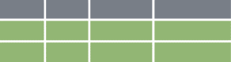
]


---
# Fünf Verben für die Datenanalyse
##`summarise()`

.left-column-reverse[

+ Im Falle von `summarise()` folgt als zweites Argument eine zusammenfassende Funktion, z. B.:


```{r}
summarise(land_bip_einwohner, durchschnitt_bip = mean(bip))
```
]

.right-column-reverse[
Stilisierte Funktionsweise:
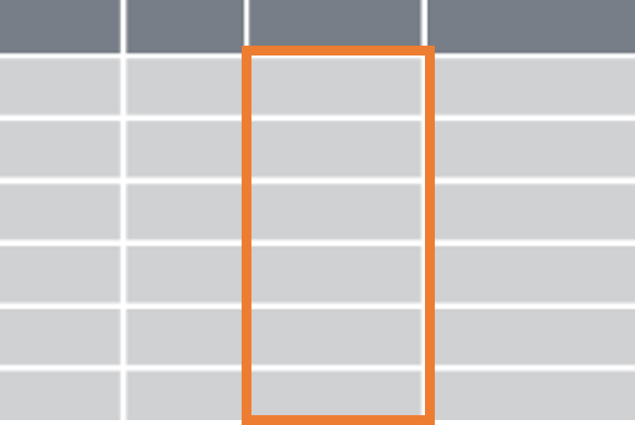
.center[.font200[&darr;]] 
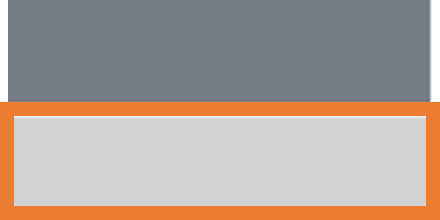
]


---
class: clear, inverse, middle, center
# Exkurs: Funktionen
###.center[Everything that happens in R is a function. .font50[~John M. Chambers]
]


---
#Funktionen

+ Funktionen sind kleine Programme, die meistens aus einem **Input** einen **Output** generieren.

+ **Input** ist alles, was **in** eine Funktion einfließt:
    + **Arguments** sind vordefinierte **Input**-Typen.
    + Den **Arguments** weisen wir **Values** zu.
    
+ Stilisierte Funktionsweise:
.center[
.font150[
 .red[Funktionsname](.orange[argument] = .green[value])
]
]    
    
+ Beispiel:

.center[
.font150[
 .red[mean](.orange[x] = .green[c(100,200,NA)], 
 .orange[na.rm] = .green[TRUE]))
]
]

---
#Funktionen

+ R-Funktionen werden wie in der Mathematik von innen nach außen gelöst, z. B.:

$$\color{orange}{f(}\color{purple}{g(}x\color{purple}{)}\color{orange}{)},$$ mit
$\color{orange}{f(}x\color{orange}{)} = x^\color{orange}{2}$ und $\color{purple}{g(}x\color{purple}{)} = x \color{purple}{+ 1}$. Dann gilt:

$$\color{orange}{f(}\color{purple}{g(}x\color{purple}{)}\color{orange}{)} = \color{orange}{f(}x \color{purple}{+ 1}\color{orange}{)} = \color{orange}{(}x \color{purple}{+ 1}\color{orange}{)^2}$$.

+ Dies wird insbesondere bei der Datenanalyse mit den fünf Verben relevant.

+ Denn bei der explorativen Datenanalyse werden häufig verschiedene Datenanalyseschritte hintereinander durchgeführt.

---
#Funktionen
### Funktionen aneinander reihen (klassisch)

+ Wollen wir in unserem Beispieldatensatz zuerst nur Beobachtungen mit einem BIP von mehr als 1.000.000 filtern, dann eine neue Variable `bip_pro_kopf` erstellen und dann den Durchschnitt bestimmen, so könnte man Folgendes schreiben:

```{r eval = F, tidy=F}

summarise(mutate(filter(land_bip_einwohner, bip > 1000000), bip_pro_kopf = bip/einwohner), 
durschn_bip_pro_kopf = mean(bip_pro_kopf))

```

+ Dieser Code ist nicht nur schwer lesbar, sondern lässt sich auch schwer schreiben.

+ Das Tidyverse bietet eine besser les- und schreibbare Alternative zu Coden, mit der **Pipe**: 

---
#Funktionen
### Funktionen aneinander reihen mit %>% (modern)

```{r eval = F, tidy=F}

land_bip_einwohner %>% 
  filter(bip > 1000000) %>% 
  mutate(bip_pro_kopf = bip/einwohner) %>%
  summarise(durschn_bip_pro_kopf = mean(bip_pro_kopf))

```

+ Die Pipe (%>%) liest sich als **&raquo;und dann&laquo;**.

+ Der Code wird, wie Text sonst auch, von oben nach unten und von links nach rechts gelesen.

+ Wir starten mit dem tibble `land_bip_einwohner` **und dann** filtern wir **und dann** erstellen wir eine neue Variable **und dann** berechnen wir den Durchschnitt.

---
#Funktionen
## Weiteres Beispiel: `group_by()` in Kombination mit `summarise()`

.left-column-reverse[

+ Mit `group_by()` werden Operationen je Gruppe durchgeführt. In Kombination mit `summarise()` lassen sich z. B. Durchschnitte je Gruppe bestimmen:


```{r tidy=T}
land_bip_einwohner %>% 
  group_by(kontinent) %>% 
  summarise(durchschnitt_bip = mean(bip),
            durchschnitt_einwohner = mean(einwohner))
```
]

.right-column-reverse[
Stilisierte Funktionsweise:
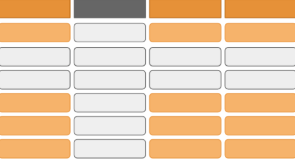
.center[.font200[&darr;]] 
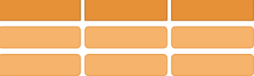
]


---
class: clear, inverse, middle, center

# Genug der Theorie. Ab nach .  


